# Packlink eCommerce Module Core - Design Document

> **Library:** `packlink/integration-core`
> **Type:** Shared PHP library consumed by platform-specific integrations
> **PHP:** >= 7.0 | **License:** Proprietary

---

## Table of Contents

1. [Context & Purpose](#1-context--purpose)
2. [High-Level Architecture](#2-high-level-architecture)
3. [Layer Responsibilities](#3-layer-responsibilities)
4. [Dependency Injection & Service Locator](#4-dependency-injection--service-locator)
5. [ORM & Entity System](#5-orm--entity-system)
6. [Task Execution Engine](#6-task-execution-engine)
7. [HTTP Communication & Packlink API Proxy](#7-http-communication--packlink-api-proxy)
8. [Business Services](#8-business-services)
9. [Controller Layer](#9-controller-layer)
10. [Shipping Method & Pricing Model](#10-shipping-method--pricing-model)
11. [OAuth Authentication Flow](#11-oauth-authentication-flow)
12. [Event System](#12-event-system)
13. [Configuration & Multi-Tenancy](#13-configuration--multi-tenancy)
14. [Brand System](#14-brand-system)
15. [Key Business Flows](#15-key-business-flows)
16. [Entity Catalog](#16-entity-catalog)
17. [Platform Integration Contract](#17-platform-integration-contract)
18. [Non-Functional Requirements](#18-non-functional-requirements)

---

## 1. Context & Purpose

This library is the **shared core** for Packlink shipping integrations across multiple e-commerce platforms (PrestaShop, WooCommerce, Magento, Shopify, etc.). It encapsulates all business logic, API communication, and infrastructure primitives so that platform modules only implement platform-specific adapters.

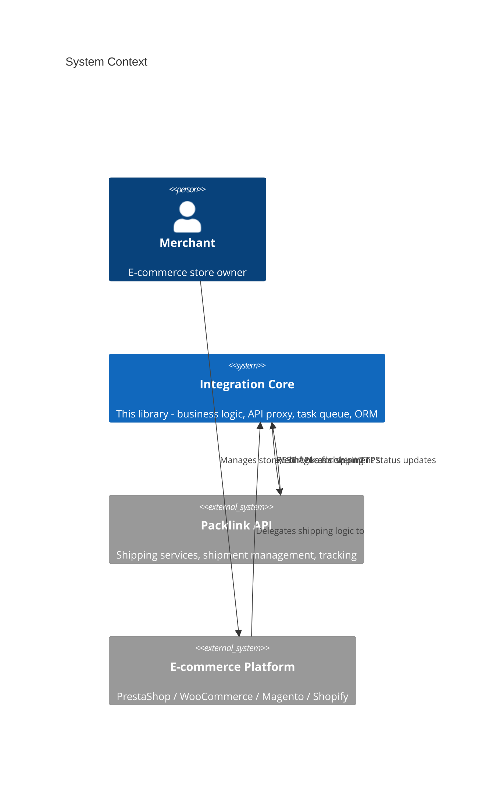
```mermaid
C4Context
    title System Context

    Person(merchant, "Merchant", "E-commerce store owner")
    System(core, "Integration Core", "This library - business logic, API proxy, task queue, ORM")
    System_Ext(packlink, "Packlink API", "Shipping services, shipment management, tracking")
    System_Ext(platform, "E-commerce Platform", "PrestaShop / WooCommerce / Magento / Shopify")

    Rel(merchant, platform, "Manages store, configures shipping")
    Rel(platform, core, "Delegates shipping logic to")
    Rel(core, packlink, "REST API calls over HTTPS")
    Rel(packlink, core, "Webhooks for shipment status updates")
```

The core is **never deployed standalone**. Each platform module wraps it, providing concrete implementations for abstract services (Configuration, HttpClient, Repositories, ShopOrderService, etc.).

---

## 2. High-Level Architecture

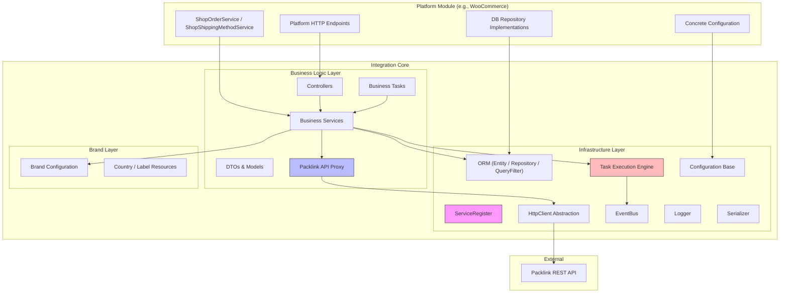
```mermaid
graph TB
    subgraph "Platform Module (e.g., WooCommerce)"
        PM_CTRL["Platform HTTP Endpoints"]
        PM_CONF["Concrete Configuration"]
        PM_REPO["DB Repository Implementations"]
        PM_SHOP["ShopOrderService / ShopShippingMethodService"]
    end

    subgraph "Integration Core"
        subgraph "Business Logic Layer"
            CTRL["Controllers"]
            SVC["Business Services"]
            TASK_BIZ["Business Tasks"]
            DTO["DTOs & Models"]
            PROXY["Packlink API Proxy"]
        end

        subgraph "Infrastructure Layer"
            SR["ServiceRegister"]
            ORM["ORM (Entity / Repository / QueryFilter)"]
            TASK_ENG["Task Execution Engine"]
            HTTP["HttpClient Abstraction"]
            EVT["EventBus"]
            LOG["Logger"]
            SER["Serializer"]
            CFG["Configuration Base"]
        end

        subgraph "Brand Layer"
            BRAND["Brand Configuration"]
            RES["Country / Label Resources"]
        end
    end

    subgraph "External"
        API["Packlink REST API"]
    end

    PM_CTRL --> CTRL
    PM_CONF --> CFG
    PM_REPO --> ORM
    PM_SHOP --> SVC

    CTRL --> SVC
    SVC --> PROXY
    SVC --> ORM
    SVC --> TASK_ENG
    PROXY --> HTTP
    HTTP --> API
    TASK_BIZ --> SVC
    TASK_ENG --> EVT
    SVC --> BRAND

    style SR fill:#f9f,stroke:#333
    style PROXY fill:#bbf,stroke:#333
    style TASK_ENG fill:#fbb,stroke:#333
```

---

## 3. Layer Responsibilities

### 3.1 Infrastructure (`Logeecom\Infrastructure\`)

Platform-agnostic framework layer. Contains no Packlink business concepts.

| Component | Responsibility |
|-----------|---------------|
| `ServiceRegister` | Service locator / DI container |
| `Singleton` | Base class for singleton services |
| `ORM` | Entity base, RepositoryRegistry, QueryFilter, IndexMap |
| `TaskExecution` | Queue, TaskRunner, QueueItem state machine, async execution |
| `Http` | HttpClient abstraction, CurlHttpClient, AsyncSocketHttpClient |
| `Serializer` | NativeSerializer and JsonSerializer with class preservation |
| `Logger` | Structured logging with levels (ERROR=0, WARNING=1, INFO=2, DEBUG=3) |
| `EventBus` | Pub/sub event system |
| `Configuration` | Abstract key-value config backed by ConfigEntity ORM |

### 3.2 Business Logic (`Packlink\BusinessLogic\`)

Packlink-specific domain: shipping, orders, warehouses, customs, registration.

| Component | Responsibility |
|-----------|---------------|
| `Controllers/` | Thin entry points called by platform HTTP handlers |
| `Http/Proxy` | All Packlink API communication (REST client) |
| `Http/DTO/` | Request/response DTOs for the Packlink API |
| `ShippingMethod/` | Shipping method management, pricing engine, cost calculation |
| `Order/` | Order-to-draft conversion, shipment tracking |
| `Warehouse/` | Warehouse (origin) configuration |
| `User/` | Login, initialization, account setup |
| `Registration/` | New Packlink account creation |
| `ShipmentDraft/` | Async draft creation task management |
| `Customs/` | International customs invoice generation |
| `CashOnDelivery/` | COD fee calculation and configuration |
| `OAuth/` | OAuth 2.0 authorization code flow |
| `Country/` | Supported country resolution per brand |
| `Scheduler/` | Recurring task scheduling interface |
| `UpdateShippingServices/` | Orchestrated async shipping method sync |

### 3.3 Brand (`Packlink\Brands\`)

Brand-specific configuration and resource overrides. Currently only the Packlink (`PRO`) brand.

| Component | Responsibility |
|-----------|---------------|
| `PacklinkConfigurationService` | Platform code, supported countries, registration countries |
| `Resources/countries/` | Per-country JSON files with labels, phone prefixes, postal rules |

---

## 4. Dependency Injection & Service Locator

All dependencies are resolved through `ServiceRegister`, a static service locator.

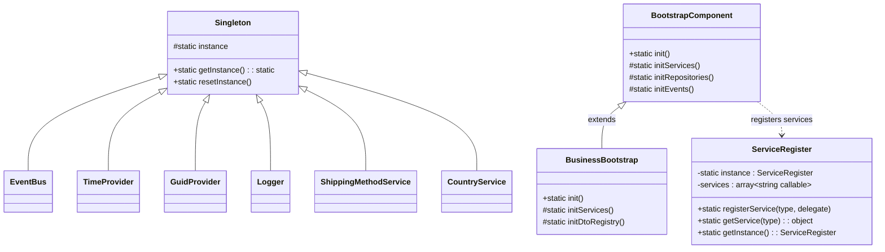
```mermaid
classDiagram
    class ServiceRegister {
        -static instance : ServiceRegister
        -services : array~string callable~
        +static registerService(type, delegate)
        +static getService(type) : object
        +static getInstance() : ServiceRegister
    }

    class Singleton {
        #static instance
        +static getInstance() : static
        +static resetInstance()
    }

    class BootstrapComponent {
        +static init()
        #static initServices()
        #static initRepositories()
        #static initEvents()
    }

    class BusinessBootstrap {
        +static init()
        #static initServices()
        #static initDtoRegistry()
    }

    BootstrapComponent <|-- BusinessBootstrap : extends
    BootstrapComponent ..> ServiceRegister : registers services
    Singleton <|-- EventBus
    Singleton <|-- TimeProvider
    Singleton <|-- GuidProvider
    Singleton <|-- Logger
    Singleton <|-- ShippingMethodService
    Singleton <|-- CountryService
```

**Bootstrap Chain:**

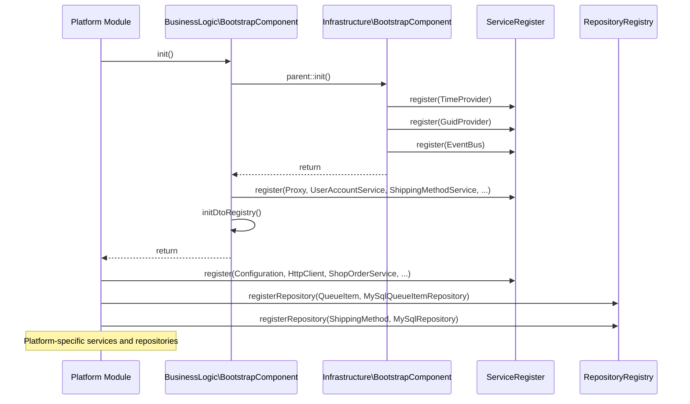
```mermaid
sequenceDiagram
    participant Platform as Platform Module
    participant BizBoot as BusinessLogic\BootstrapComponent
    participant InfraBoot as Infrastructure\BootstrapComponent
    participant SR as ServiceRegister
    participant RR as RepositoryRegistry

    Platform->>BizBoot: init()
    BizBoot->>InfraBoot: parent::init()
    InfraBoot->>SR: register(TimeProvider)
    InfraBoot->>SR: register(GuidProvider)
    InfraBoot->>SR: register(EventBus)
    InfraBoot-->>BizBoot: return
    BizBoot->>SR: register(Proxy, UserAccountService, ShippingMethodService, ...)
    BizBoot->>BizBoot: initDtoRegistry()
    BizBoot-->>Platform: return
    Platform->>SR: register(Configuration, HttpClient, ShopOrderService, ...)
    Platform->>RR: registerRepository(QueueItem, MySqlQueueItemRepository)
    Platform->>RR: registerRepository(ShippingMethod, MySqlRepository)
    Note over Platform: Platform-specific services and repositories
```

**Service Registration Pattern:**
```php
ServiceRegister::registerService(
    MyService::CLASS_NAME,           // Fully qualified class name as key
    function () {                    // Lazy factory delegate
        return MyService::getInstance();
    }
);

$service = ServiceRegister::getService(MyService::CLASS_NAME);
```

Every service or singleton uses `const CLASS_NAME = __CLASS__` as the canonical registration key.

---

## 5. ORM & Entity System

### 5.1 Entity Model

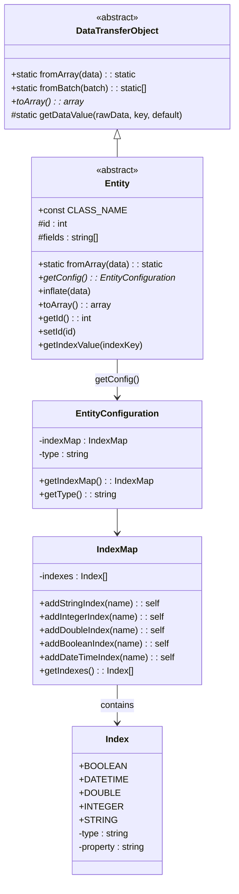
```mermaid
classDiagram
    class DataTransferObject {
        <<abstract>>
        +static fromArray(data) : static
        +static fromBatch(batch) : static[]
        +toArray() : array*
        #static getDataValue(rawData, key, default)
    }

    class Entity {
        <<abstract>>
        +const CLASS_NAME
        #id : int
        #fields : string[]
        +static fromArray(data) : static
        +getConfig() : EntityConfiguration*
        +inflate(data)
        +toArray() : array
        +getId() : int
        +setId(id)
        +getIndexValue(indexKey)
    }

    class EntityConfiguration {
        -indexMap : IndexMap
        -type : string
        +getIndexMap() : IndexMap
        +getType() : string
    }

    class IndexMap {
        -indexes : Index[]
        +addStringIndex(name) : self
        +addIntegerIndex(name) : self
        +addDoubleIndex(name) : self
        +addBooleanIndex(name) : self
        +addDateTimeIndex(name) : self
        +getIndexes() : Index[]
    }

    class Index {
        +BOOLEAN
        +DATETIME
        +DOUBLE
        +INTEGER
        +STRING
        -type : string
        -property : string
    }

    DataTransferObject <|-- Entity
    Entity --> EntityConfiguration : getConfig()
    EntityConfiguration --> IndexMap
    IndexMap --> Index : contains
```

Each entity defines a `$fields` array for serialization and a `getConfig()` returning an `EntityConfiguration` with an `IndexMap`. The index map tells platform repository implementations which columns to index in their storage.

### 5.2 Repository System

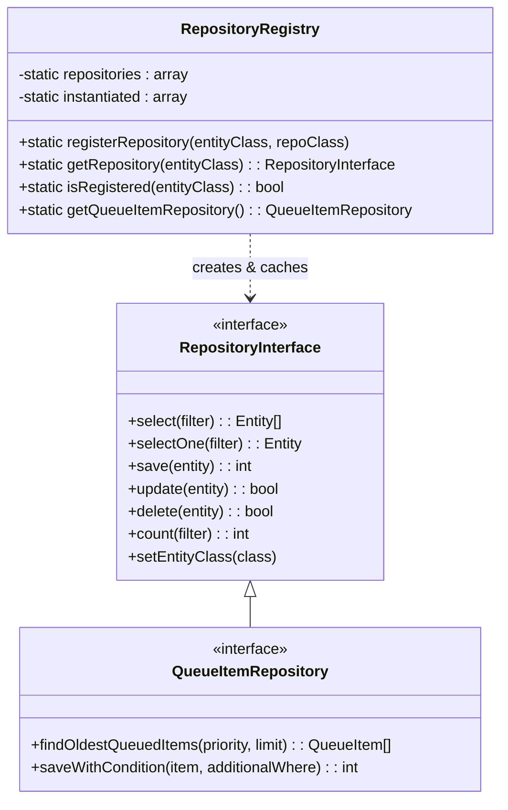
```mermaid
classDiagram
    class RepositoryInterface {
        <<interface>>
        +select(filter) : Entity[]
        +selectOne(filter) : Entity
        +save(entity) : int
        +update(entity) : bool
        +delete(entity) : bool
        +count(filter) : int
        +setEntityClass(class)
    }

    class QueueItemRepository {
        <<interface>>
        +findOldestQueuedItems(priority, limit) : QueueItem[]
        +saveWithCondition(item, additionalWhere) : int
    }

    class RepositoryRegistry {
        -static repositories : array
        -static instantiated : array
        +static registerRepository(entityClass, repoClass)
        +static getRepository(entityClass) : RepositoryInterface
        +static isRegistered(entityClass) : bool
        +static getQueueItemRepository() : QueueItemRepository
    }

    RepositoryInterface <|-- QueueItemRepository
    RepositoryRegistry ..> RepositoryInterface : creates & caches
```

### 5.3 Query Filter

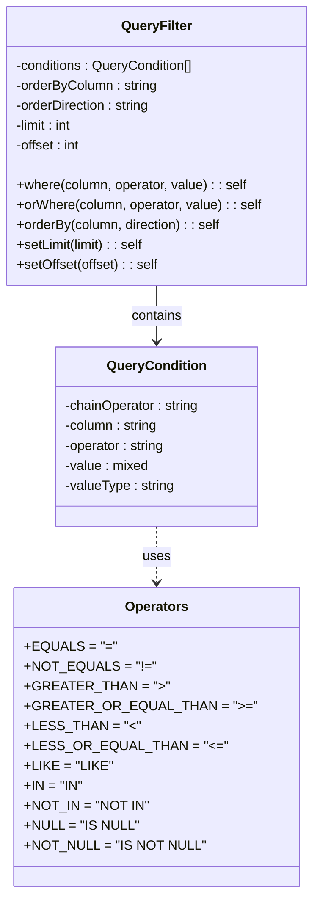
```mermaid
classDiagram
    class QueryFilter {
        -conditions : QueryCondition[]
        -orderByColumn : string
        -orderDirection : string
        -limit : int
        -offset : int
        +where(column, operator, value) : self
        +orWhere(column, operator, value) : self
        +orderBy(column, direction) : self
        +setLimit(limit) : self
        +setOffset(offset) : self
    }

    class QueryCondition {
        -chainOperator : string
        -column : string
        -operator : string
        -value : mixed
        -valueType : string
    }

    class Operators {
        +EQUALS = "="
        +NOT_EQUALS = "!="
        +GREATER_THAN = ">"
        +GREATER_OR_EQUAL_THAN = ">="
        +LESS_THAN = "<"
        +LESS_OR_EQUAL_THAN = "<="
        +LIKE = "LIKE"
        +IN = "IN"
        +NOT_IN = "NOT IN"
        +NULL = "IS NULL"
        +NOT_NULL = "IS NOT NULL"
    }

    QueryFilter --> QueryCondition : contains
    QueryCondition ..> Operators : uses
```

Operator applicability is type-constrained: `LIKE` is string-only, `IN`/`NOT IN` are array-only, comparison operators work on numeric/datetime/string types.

---

## 6. Task Execution Engine

### 6.1 QueueItem State Machine

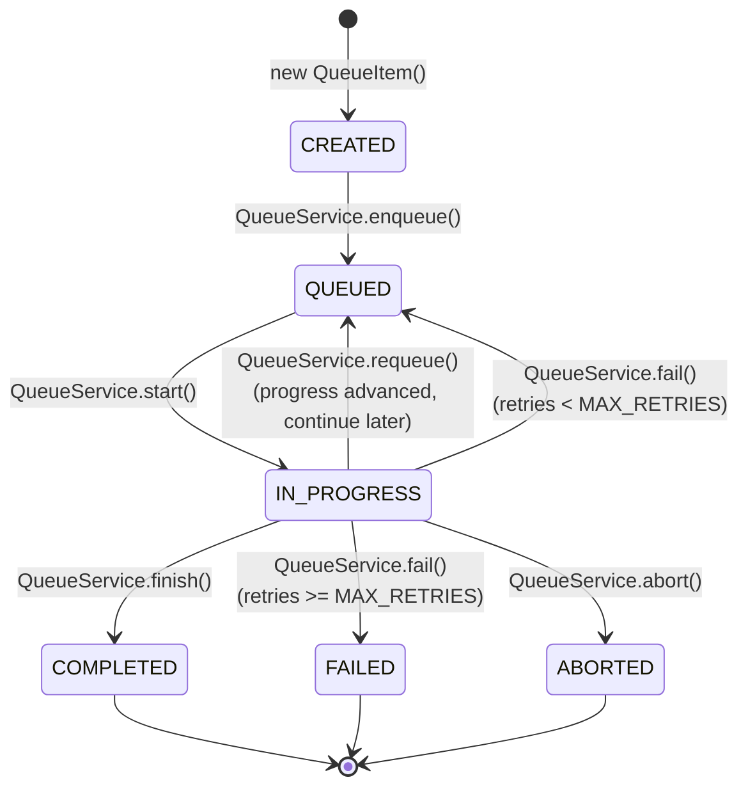
```mermaid
stateDiagram-v2
    [*] --> CREATED : new QueueItem()
    CREATED --> QUEUED : QueueService.enqueue()

    QUEUED --> IN_PROGRESS : QueueService.start()

    IN_PROGRESS --> COMPLETED : QueueService.finish()
    IN_PROGRESS --> QUEUED : QueueService.requeue()<br/>(progress advanced, continue later)
    IN_PROGRESS --> QUEUED : QueueService.fail()<br/>(retries < MAX_RETRIES)
    IN_PROGRESS --> FAILED : QueueService.fail()<br/>(retries >= MAX_RETRIES)
    IN_PROGRESS --> ABORTED : QueueService.abort()

    COMPLETED --> [*]
    FAILED --> [*]
    ABORTED --> [*]
```

**QueueItem key fields:** `status`, `serializedTask`, `queueName`, `context`, `priority`, `progressBasePoints` (0-10000), `retries`, `failureDescription`, `createTime`, `startTime`, `finishTime`, `lastUpdateTime`.

### 6.2 Task Class Hierarchy

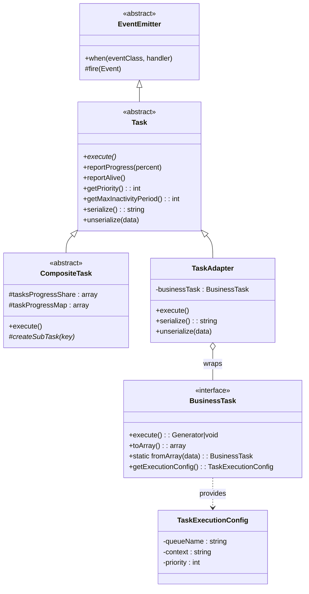
```mermaid
classDiagram
    class EventEmitter {
        <<abstract>>
        +when(eventClass, handler)
        #fire(Event)
    }

    class Task {
        <<abstract>>
        +execute()*
        +reportProgress(percent)
        +reportAlive()
        +getPriority() : int
        +getMaxInactivityPeriod() : int
        +serialize() : string
        +unserialize(data)
    }

    class CompositeTask {
        <<abstract>>
        #tasksProgressShare : array
        #taskProgressMap : array
        +execute()
        #createSubTask(key)*
    }

    class BusinessTask {
        <<interface>>
        +execute() : Generator|void
        +toArray() : array
        +static fromArray(data) : BusinessTask
        +getExecutionConfig() : TaskExecutionConfig
    }

    class TaskAdapter {
        -businessTask : BusinessTask
        +execute()
        +serialize() : string
        +unserialize(data)
    }

    class TaskExecutionConfig {
        -queueName : string
        -context : string
        -priority : int
    }

    EventEmitter <|-- Task
    Task <|-- CompositeTask
    Task <|-- TaskAdapter
    TaskAdapter o-- BusinessTask : wraps
    BusinessTask ..> TaskExecutionConfig : provides
```

**Infrastructure Tasks** (extend `Task`): `TaskCleanupTask`, `BatchTaskCleanupTask`, `ScheduleCheckTask`

**Business Tasks** (implement `BusinessTask`): `SendDraftBusinessTask`, `UpdateShippingServicesBusinessTask`, `GetDefaultParcelAndWarehouseBusinessTask`, `AutoTestBusinessTask`

### 6.3 Task Execution Flow

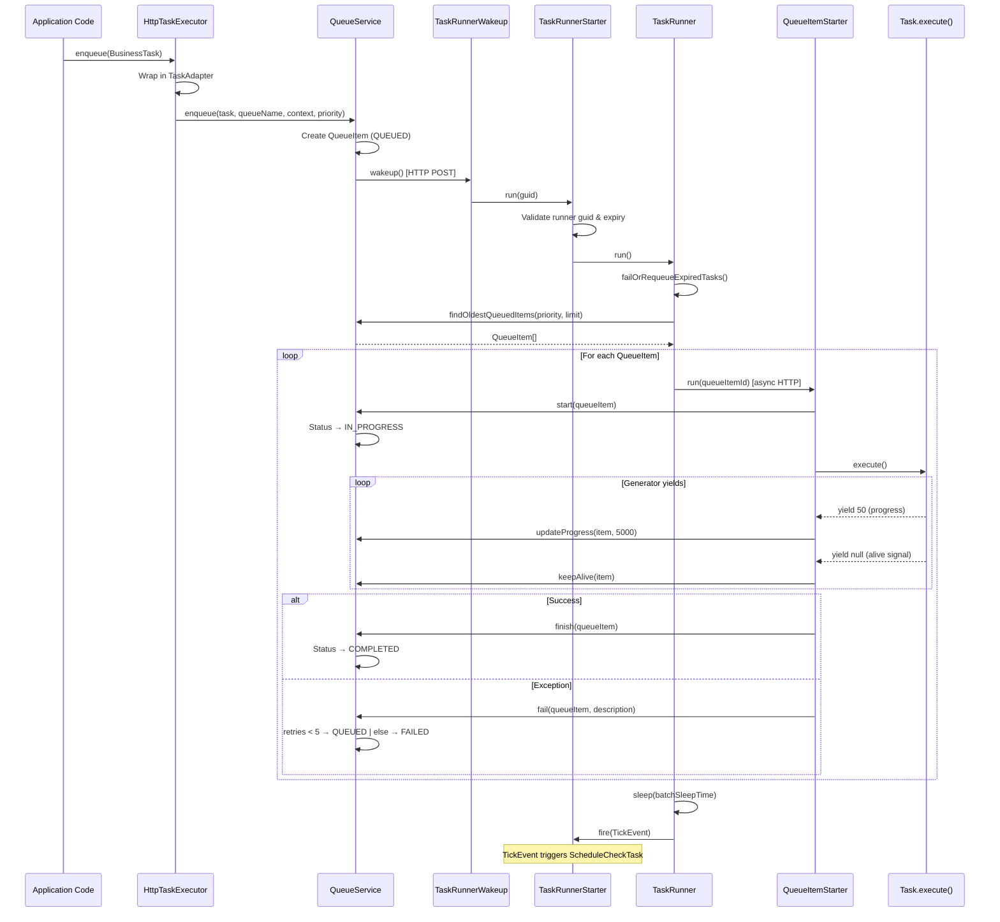
```mermaid
sequenceDiagram
    participant App as Application Code
    participant TE as HttpTaskExecutor
    participant QS as QueueService
    participant TRW as TaskRunnerWakeup
    participant TRS as TaskRunnerStarter
    participant TR as TaskRunner
    participant QIS as QueueItemStarter
    participant Task as Task.execute()

    App->>TE: enqueue(BusinessTask)
    TE->>TE: Wrap in TaskAdapter
    TE->>QS: enqueue(task, queueName, context, priority)
    QS->>QS: Create QueueItem (QUEUED)
    QS->>TRW: wakeup() [HTTP POST]

    TRW->>TRS: run(guid)
    TRS->>TRS: Validate runner guid & expiry
    TRS->>TR: run()

    TR->>TR: failOrRequeueExpiredTasks()
    TR->>QS: findOldestQueuedItems(priority, limit)
    QS-->>TR: QueueItem[]

    loop For each QueueItem
        TR->>QIS: run(queueItemId) [async HTTP]
        QIS->>QS: start(queueItem)
        QS->>QS: Status → IN_PROGRESS
        QIS->>Task: execute()

        loop Generator yields
            Task-->>QIS: yield 50 (progress)
            QIS->>QS: updateProgress(item, 5000)
            Task-->>QIS: yield null (alive signal)
            QIS->>QS: keepAlive(item)
        end

        alt Success
            QIS->>QS: finish(queueItem)
            QS->>QS: Status → COMPLETED
        else Exception
            QIS->>QS: fail(queueItem, description)
            QS->>QS: retries < 5 → QUEUED | else → FAILED
        end
    end

    TR->>TR: sleep(batchSleepTime)
    TR->>TRS: fire(TickEvent)
    Note over TRS: TickEvent triggers ScheduleCheckTask
```

### 6.4 Progress Tracking

Progress uses **base points** (0-10000, where 1 bp = 0.01%). Business tasks `yield` percentage values (0-100) which `TaskAdapter` converts and fires as `TaskProgressEvent`.

**CompositeTask** aggregates sub-task progress via weighted shares:
```
Overall = sum(subTaskProgress[i] * weightShare[i]) for all sub-tasks
```

### 6.5 Priority System


```mermaid
graph LR
    HIGH["HIGH = 1000"] --> NORMAL["NORMAL = 100"] --> LOW["LOW = 1"]
    style HIGH fill:#f66
    style NORMAL fill:#ff9
    style LOW fill:#9f9
```

`QueueService.findOldestQueuedItems()` respects priority ordering. Tasks can override `getPriority()` or specify priority via `TaskExecutionConfig`.

### 6.6 Scheduler

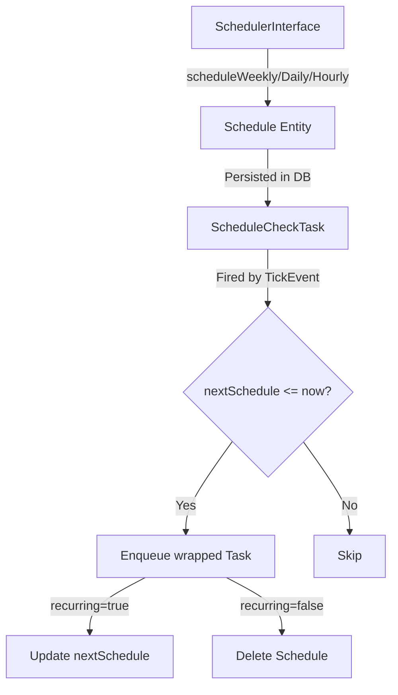
```mermaid
graph TD
    A[SchedulerInterface] -->|scheduleWeekly/Daily/Hourly| B[Schedule Entity]
    B -->|Persisted in DB| C[ScheduleCheckTask]
    C -->|Fired by TickEvent| D{nextSchedule <= now?}
    D -->|Yes| E[Enqueue wrapped Task]
    D -->|No| F[Skip]
    E -->|recurring=true| G[Update nextSchedule]
    E -->|recurring=false| H[Delete Schedule]
```

Schedule models: `WeeklySchedule`, `DailySchedule`, `HourlySchedule` - all extend `Schedule` entity with cron-like fields.

---

## 7. HTTP Communication & Packlink API Proxy

### 7.1 HTTP Client Abstraction

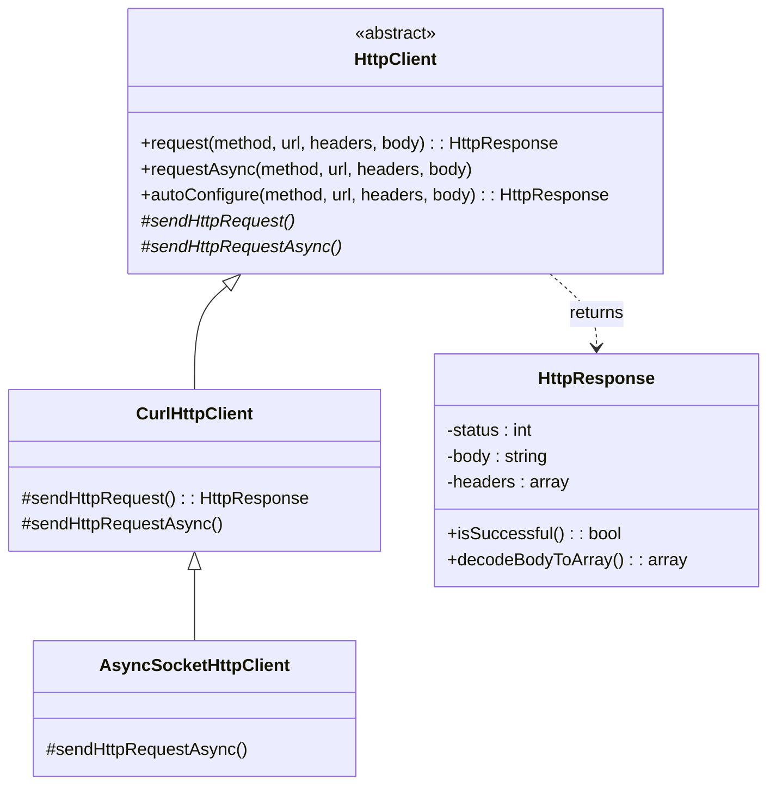
```mermaid
classDiagram
    class HttpClient {
        <<abstract>>
        +request(method, url, headers, body) : HttpResponse
        +requestAsync(method, url, headers, body)
        +autoConfigure(method, url, headers, body) : HttpResponse
        #sendHttpRequest()*
        #sendHttpRequestAsync()*
    }

    class CurlHttpClient {
        #sendHttpRequest() : HttpResponse
        #sendHttpRequestAsync()
    }

    class AsyncSocketHttpClient {
        #sendHttpRequestAsync()
    }

    class HttpResponse {
        -status : int
        -body : string
        -headers : array
        +isSuccessful() : bool
        +decodeBodyToArray() : array
    }

    HttpClient <|-- CurlHttpClient
    CurlHttpClient <|-- AsyncSocketHttpClient
    HttpClient ..> HttpResponse : returns
```

`CurlHttpClient` supports auto-configuration with 8 combinations of cURL options (redirect modes, IP resolution, protocol switching). `AsyncSocketHttpClient` uses raw PHP sockets for lower-overhead async requests.

### 7.2 Packlink API Proxy

The `Proxy` class is the single point of contact with the Packlink REST API (`https://api.packlink.com/v1/`).

**All endpoints:**

| Category | Method | Verb | Endpoint |
|----------|--------|------|----------|
| **User** | `getUserData()` | GET | `clients` |
| **User** | `register(data)` | POST | `register` |
| **User** | `getUsersParcelInfo()` | GET | `users/parcels` |
| **User** | `getUsersWarehouses()` | GET | `clients/warehouses` |
| **Services** | `getShippingServicesDeliveryDetails(search)` | GET | `services?{params}` |
| **Services** | `getShippingServiceDetails(id)` | GET | `services/available/{id}/details` |
| **Locations** | `getLocations(serviceId, country, zip)` | GET | `dropoffs/{serviceId}/{country}/{zip}` |
| **Locations** | `searchLocations(country, zone, query)` | GET | `locations/postalcodes?...` |
| **Locations** | `getPostalCodes(country, zip)` | GET | `locations/postalcodes/{country}/{zip}` |
| **Locations** | `getPostalZones(country, lang)` | GET | `locations/postalzones/destinations?...` |
| **Shipments** | `sendDraft(draft)` | POST | `shipments` |
| **Shipments** | `getShipment(ref)` | GET | `shipments/{ref}` |
| **Shipments** | `getLabels(ref)` | GET | `shipments/{ref}/labels` |
| **Shipments** | `getTrackingInfo(ref)` | GET | `shipments/{ref}/track` |
| **Webhooks** | `registerWebHookHandler(url)` | POST | `shipments/callback` |
| **Customs** | `getCustomsByPostalCode(search)` | POST | `customs-unions/search-by-postal-code` |
| **Customs** | `sendCustomsInvoice(invoice)` | POST | `customs-invoices` |
| **Customs** | `getCustomsInvoiceDownloadUrl(id)` | GET | `customs-invoices/{id}/download` |
| **OAuth** | `getApiKeyWithToken(token)` | POST/GET | `users/api/keys` |
| **Analytics** | `sendAnalytics(event)` | POST | `analytics` |

**Request headers** on every call:
- `Authorization: {apiToken}` (or `Bearer {oauthToken}`)
- `Accept: application/json`
- `Content-Type: application/json`
- `X-Module-Version`, `X-Ecommerce-Name`, `X-Ecommerce-Version`

**Error handling:** 401 throws `HttpAuthenticationException`; 404 on shipment endpoints returns `null`; other failures throw `HttpRequestException`. Analytics errors are suppressed (logged as warning).

### 7.3 DTO Catalog

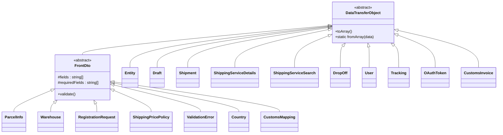
```mermaid
classDiagram
    class DataTransferObject {
        <<abstract>>
        +toArray()
        +static fromArray(data)
    }

    class FrontDto {
        <<abstract>>
        #fields : string[]
        #requiredFields : string[]
        +validate()
    }

    DataTransferObject <|-- Entity
    DataTransferObject <|-- FrontDto

    DataTransferObject <|-- Draft
    DataTransferObject <|-- Shipment
    DataTransferObject <|-- ShippingServiceDetails
    DataTransferObject <|-- ShippingServiceSearch
    DataTransferObject <|-- DropOff
    DataTransferObject <|-- User
    DataTransferObject <|-- Tracking
    DataTransferObject <|-- OAuthToken
    DataTransferObject <|-- CustomsInvoice

    FrontDto <|-- ParcelInfo
    FrontDto <|-- Warehouse
    FrontDto <|-- RegistrationRequest
    FrontDto <|-- ShippingPricePolicy
    FrontDto <|-- ValidationError
    FrontDto <|-- Country
    FrontDto <|-- CustomsMapping
```

**Key API DTOs:**

| DTO | Purpose | Key Fields |
|-----|---------|------------|
| `Draft` | Create shipment | from/to Address, packages[], serviceId, content, price, customs |
| `Shipment` | Shipment response | reference, status, trackingCodes, price, carrier |
| `ShippingServiceSearch` | Query available services | fromCountry, fromZip, toCountry, toZip, packages[] |
| `ShippingServiceDetails` | Service with pricing | id, carrierName, basePrice, totalPrice, transitTime, tags |
| `Package` | Package dimensions | weight (kg), width/height/length (cm) |
| `DropOff` | Drop-off location | id, name, address, lat/long, workingHours |
| `CustomsInvoice` | Customs docs | sender, receiver, inventoryContents[], shipmentDetails |

**FrontDto** adds validation (`validate()`, `validateRequiredFields()`). Registered in `FrontDtoFactory` with string keys for frontend/API deserialization.

---

## 8. Business Services

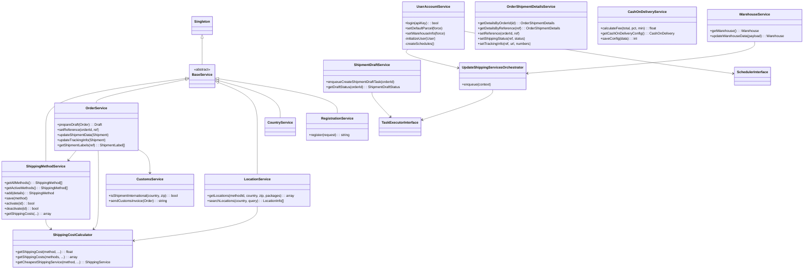
```mermaid
classDiagram
    class BaseService {
        <<abstract>>
    }

    class UserAccountService {
        +login(apiKey) : bool
        +setDefaultParcel(force)
        +setWarehouseInfo(force)
        -initializeUser(User)
        -createSchedules()
    }

    class ShippingMethodService {
        +getAllMethods() : ShippingMethod[]
        +getActiveMethods() : ShippingMethod[]
        +add(details) : ShippingMethod
        +save(method)
        +activate(id) : bool
        +deactivate(id) : bool
        +getShippingCosts(...) : array
    }

    class WarehouseService {
        +getWarehouse() : Warehouse
        +updateWarehouseData(payload) : Warehouse
    }

    class OrderService {
        +prepareDraft(Order) : Draft
        +setReference(orderId, ref)
        +updateShipmentData(Shipment)
        +updateTrackingInfo(Shipment)
        +getShipmentLabels(ref) : ShipmentLabel[]
    }

    class ShipmentDraftService {
        +enqueueCreateShipmentDraftTask(orderId)
        +getDraftStatus(orderId) : ShipmentDraftStatus
    }

    class LocationService {
        +getLocations(methodId, country, zip, packages) : array
        +searchLocations(country, query) : LocationInfo[]
    }

    class RegistrationService {
        +register(request) : string
    }

    class CustomsService {
        +isShipmentInternational(country, zip) : bool
        +sendCustomsInvoice(Order) : string
    }

    class OrderShipmentDetailsService {
        +getDetailsByOrderId(id) : OrderShipmentDetails
        +getDetailsByReference(ref) : OrderShipmentDetails
        +setReference(orderId, ref)
        +setShippingStatus(ref, status)
        +setTrackingInfo(ref, url, numbers)
    }

    class CashOnDeliveryService {
        +calculateFee(total, pct, min) : float
        +getCashOnDeliveryConfig() : CashOnDelivery
        +saveConfig(data) : int
    }

    class UpdateShippingServicesOrchestrator {
        +enqueue(context)
    }

    class ShippingCostCalculator {
        +getShippingCost(method, ...) : float
        +getShippingCosts(methods, ...) : array
        +getCheapestShippingService(method, ...) : ShippingService
    }

    Singleton <|-- BaseService
    BaseService <|-- ShippingMethodService
    BaseService <|-- OrderService
    BaseService <|-- LocationService
    BaseService <|-- CountryService
    BaseService <|-- RegistrationService

    UserAccountService --> UpdateShippingServicesOrchestrator
    UserAccountService --> SchedulerInterface
    ShippingMethodService --> ShippingCostCalculator
    WarehouseService --> UpdateShippingServicesOrchestrator
    OrderService --> ShippingMethodService
    OrderService --> ShippingCostCalculator
    OrderService --> CustomsService
    ShipmentDraftService --> TaskExecutorInterface
    LocationService --> ShippingCostCalculator
    UpdateShippingServicesOrchestrator --> TaskExecutorInterface
```

---

## 9. Controller Layer

Controllers are thin delegates between platform HTTP endpoints and business services. They resolve services from `ServiceRegister`, orchestrate calls, and return DTOs.

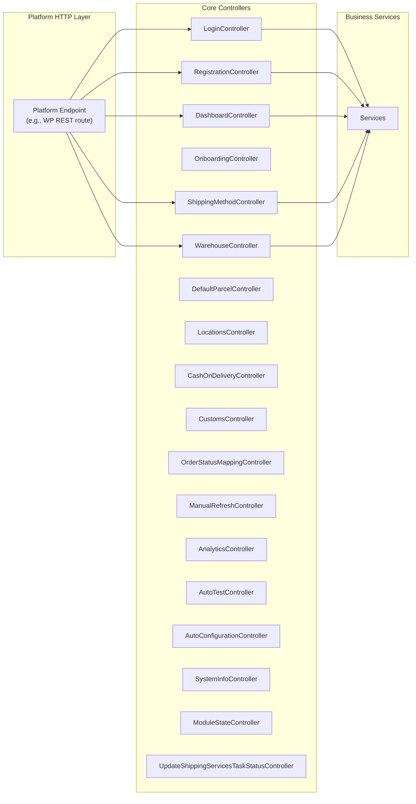
```mermaid
graph LR
    subgraph "Platform HTTP Layer"
        EP["Platform Endpoint<br/>(e.g., WP REST route)"]
    end

    subgraph "Core Controllers"
        LC[LoginController]
        RC[RegistrationController]
        DC[DashboardController]
        OC[OnboardingController]
        SMC[ShippingMethodController]
        WC[WarehouseController]
        DPC[DefaultParcelController]
        LOCC[LocationsController]
        CODC[CashOnDeliveryController]
        CUSC[CustomsController]
        OSMC[OrderStatusMappingController]
        MRC[ManualRefreshController]
        AC[AnalyticsController]
        ATC[AutoTestController]
        ACC[AutoConfigurationController]
        SIC[SystemInfoController]
        MSC[ModuleStateController]
        USTSC[UpdateShippingServicesTaskStatusController]
    end

    subgraph "Business Services"
        SVC["Services"]
    end

    EP --> LC & RC & DC & SMC & WC
    LC & RC & DC & SMC & WC --> SVC
```

| Controller | Key Methods | Delegates To |
|------------|-------------|--------------|
| `LoginController` | `login(apiKey)`, `getRedirectUrl(domain)` | UserAccountService, OAuthService |
| `RegistrationController` | `getRegisterData(country)`, `register(payload)` | RegistrationService, UserAccountService |
| `DashboardController` | `getStatus()` | Configuration (checks parcel/warehouse/method setup) |
| `OnboardingController` | `getCurrentState()` | Configuration |
| `ShippingMethodController` | `getAll()`, `getActive()`, `save(config)`, `activate(id)` | ShippingMethodService |
| `WarehouseController` | `getWarehouse()`, `updateWarehouse(data)` | WarehouseService |
| `DefaultParcelController` | `getDefaultParcel()`, `setDefaultParcel(data)` | Configuration, UpdateShippingServicesOrchestrator |
| `LocationsController` | `searchLocations(query)` | LocationService |
| `CustomsController` | `getCustomsMappings()`, `setCustomsMappings(data)` | Configuration |
| `CashOnDeliveryController` | `calculateFee(order)`, `saveConfig(data)` | CashOnDeliveryService |
| `UpdateShippingServicesTaskStatusController` | `getLastStatus()` | UpdateShippingServiceTaskStatusService |

---

## 10. Shipping Method & Pricing Model

### 10.1 Domain Model

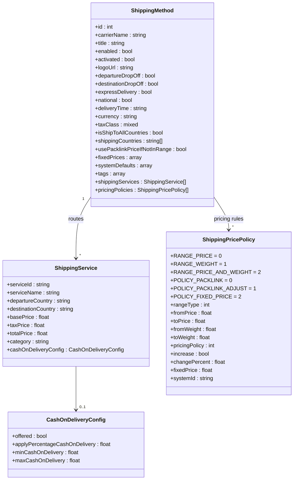
```mermaid
classDiagram
    class ShippingMethod {
        +id : int
        +carrierName : string
        +title : string
        +enabled : bool
        +activated : bool
        +logoUrl : string
        +departureDropOff : bool
        +destinationDropOff : bool
        +expressDelivery : bool
        +national : bool
        +deliveryTime : string
        +currency : string
        +taxClass : mixed
        +isShipToAllCountries : bool
        +shippingCountries : string[]
        +usePacklinkPriceIfNotInRange : bool
        +fixedPrices : array
        +systemDefaults : array
        +tags : array
        +shippingServices : ShippingService[]
        +pricingPolicies : ShippingPricePolicy[]
    }

    class ShippingService {
        +serviceId : string
        +serviceName : string
        +departureCountry : string
        +destinationCountry : string
        +basePrice : float
        +taxPrice : float
        +totalPrice : float
        +category : string
        +cashOnDeliveryConfig : CashOnDeliveryConfig
    }

    class ShippingPricePolicy {
        +RANGE_PRICE = 0
        +RANGE_WEIGHT = 1
        +RANGE_PRICE_AND_WEIGHT = 2
        +POLICY_PACKLINK = 0
        +POLICY_PACKLINK_ADJUST = 1
        +POLICY_FIXED_PRICE = 2
        +rangeType : int
        +fromPrice : float
        +toPrice : float
        +fromWeight : float
        +toWeight : float
        +pricingPolicy : int
        +increase : bool
        +changePercent : float
        +fixedPrice : float
        +systemId : string
    }

    class CashOnDeliveryConfig {
        +offered : bool
        +applyPercentageCashOnDelivery : float
        +minCashOnDelivery : float
        +maxCashOnDelivery : float
    }

    ShippingMethod "1" --> "*" ShippingService : routes
    ShippingMethod "1" --> "*" ShippingPricePolicy : pricing rules
    ShippingService --> "0..1" CashOnDeliveryConfig
```

A `ShippingMethod` groups multiple `ShippingService` instances (one per origin-destination route). `ShippingPricePolicy` objects define merchant pricing overrides.

### 10.2 Pricing Calculation Flow

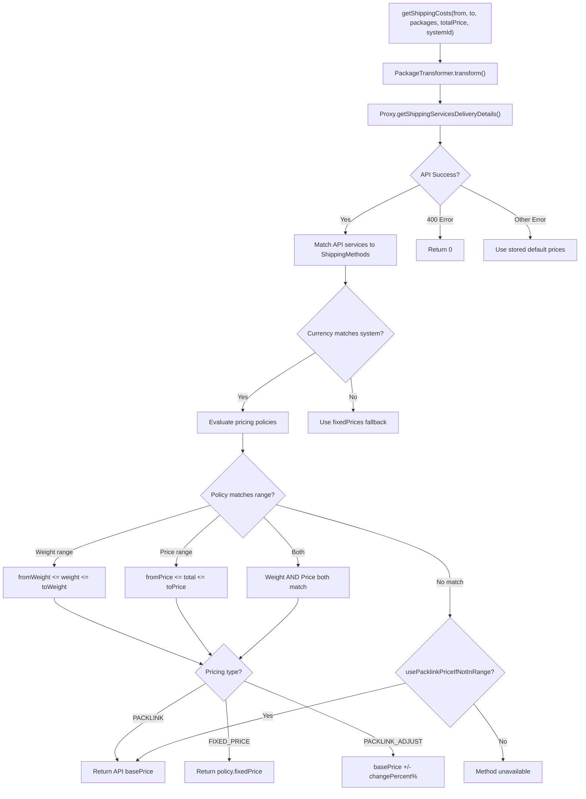
```mermaid
flowchart TD
    A["getShippingCosts(from, to, packages, totalPrice, systemId)"] --> B["PackageTransformer.transform()"]
    B --> C["Proxy.getShippingServicesDeliveryDetails()"]
    C --> D{API Success?}

    D -->|Yes| E["Match API services to ShippingMethods"]
    D -->|400 Error| F["Return 0"]
    D -->|Other Error| G["Use stored default prices"]

    E --> H{Currency matches system?}
    H -->|Yes| I["Evaluate pricing policies"]
    H -->|No| J["Use fixedPrices fallback"]

    I --> K{Policy matches range?}
    K -->|Weight range| L["fromWeight <= weight <= toWeight"]
    K -->|Price range| M["fromPrice <= total <= toPrice"]
    K -->|Both| N["Weight AND Price both match"]

    L & M & N --> O{Pricing type?}
    O -->|PACKLINK| P["Return API basePrice"]
    O -->|FIXED_PRICE| Q["Return policy.fixedPrice"]
    O -->|PACKLINK_ADJUST| R["basePrice +/- changePercent%"]

    K -->|No match| S{usePacklinkPriceIfNotInRange?}
    S -->|Yes| P
    S -->|No| T["Method unavailable"]
```

### 10.3 Shipping Services Sync

The `UpdateShippingServicesBusinessTask` periodically synchronizes local methods with the Packlink API:

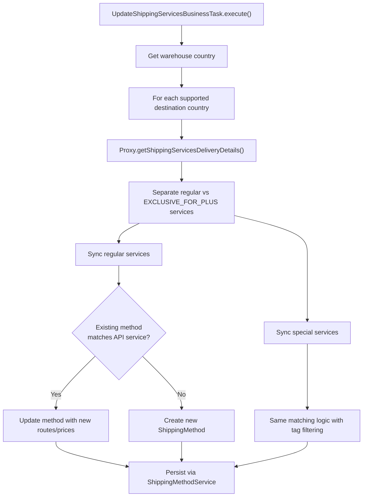
```mermaid
flowchart TD
    A["UpdateShippingServicesBusinessTask.execute()"] --> B["Get warehouse country"]
    B --> C["For each supported destination country"]
    C --> D["Proxy.getShippingServicesDeliveryDetails()"]
    D --> E["Separate regular vs EXCLUSIVE_FOR_PLUS services"]

    E --> F["Sync regular services"]
    F --> G{"Existing method<br/>matches API service?"}
    G -->|Yes| H["Update method with new routes/prices"]
    G -->|No| I["Create new ShippingMethod"]

    E --> J["Sync special services"]
    J --> K["Same matching logic with tag filtering"]

    H & I & K --> L["Persist via ShippingMethodService"]
```

**Matching criteria:** carrierName, national, expressDelivery, departureDropOff, destinationDropOff, currency.

---

## 11. OAuth Authentication Flow

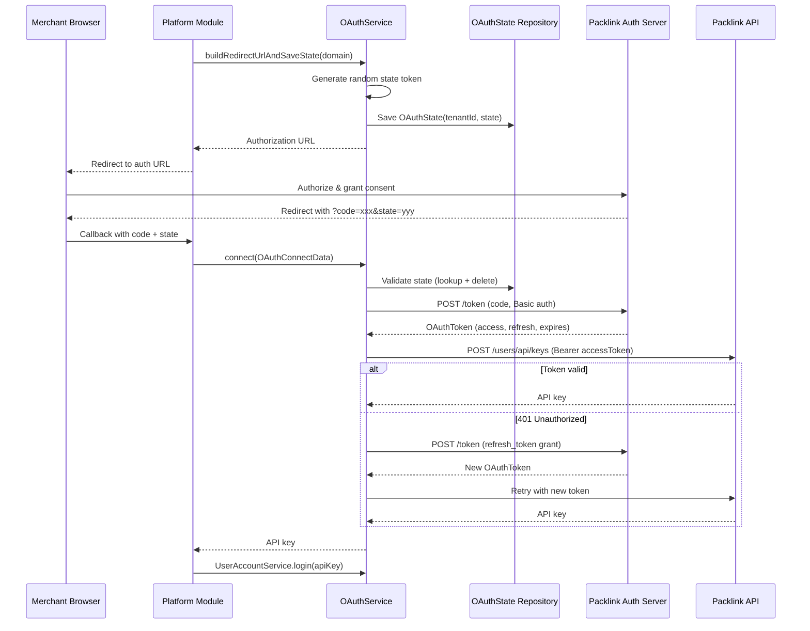
```mermaid
sequenceDiagram
    participant User as Merchant Browser
    participant Platform as Platform Module
    participant Core as OAuthService
    participant StateDB as OAuthState Repository
    participant AuthServer as Packlink Auth Server
    participant API as Packlink API

    Platform->>Core: buildRedirectUrlAndSaveState(domain)
    Core->>Core: Generate random state token
    Core->>StateDB: Save OAuthState(tenantId, state)
    Core-->>Platform: Authorization URL
    Platform-->>User: Redirect to auth URL

    User->>AuthServer: Authorize & grant consent
    AuthServer-->>User: Redirect with ?code=xxx&state=yyy
    User->>Platform: Callback with code + state

    Platform->>Core: connect(OAuthConnectData)
    Core->>StateDB: Validate state (lookup + delete)
    Core->>AuthServer: POST /token (code, Basic auth)
    AuthServer-->>Core: OAuthToken (access, refresh, expires)

    Core->>API: POST /users/api/keys (Bearer accessToken)
    alt Token valid
        API-->>Core: API key
    else 401 Unauthorized
        Core->>AuthServer: POST /token (refresh_token grant)
        AuthServer-->>Core: New OAuthToken
        Core->>API: Retry with new token
        API-->>Core: API key
    end

    Core-->>Platform: API key
    Platform->>Core: UserAccountService.login(apiKey)
```

**OAuth Configuration** (abstract, platform-specific): `clientId`, `clientSecret`, `redirectUri`, `scopes[]`, `domain`, `tenantId`.

---

## 12. Event System

### 12.1 Architecture

```mermaid
classDiagram
    class Event {
        <<abstract>>
    }

    class EventEmitter {
        <<abstract>>
        #handlers : array
        +when(eventClass, handler)
        #fire(Event)
    }

    class EventBus {
        <<singleton>>
        +fire(Event)
    }

    EventEmitter <|-- EventBus
    EventEmitter <|-- Task

    Event <|-- QueueStatusChangedEvent
    Event <|-- BeforeQueueStatusChangeEvent
    Event <|-- TaskProgressEvent
    Event <|-- AliveAnnouncedTaskEvent
    Event <|-- TickEvent
```

### 12.2 Event Catalog

| Event | Fired By | Purpose | Key Data |
|-------|----------|---------|----------|
| `TaskProgressEvent` | `Task.reportProgress()` | Progress update during execution | `progressBasePoints` (0-10000) |
| `AliveAnnouncedTaskEvent` | `Task.reportAlive()` | Heartbeat (throttled to 2s) | None |
| `BeforeQueueStatusChangeEvent` | `QueueService` (before save) | Pre-transition hook | `queueItem`, `previousState` |
| `QueueStatusChangedEvent` | `QueueService` (after save) | Post-transition notification | `queueItem`, `previousState` |
| `TickEvent` | `TaskRunnerStarter` | Scheduler trigger after runner completes | None |

### 12.3 Event Flow

```mermaid
sequenceDiagram
    participant Task
    participant QueueItem as QueueItem (event handler)
    participant QueueService
    participant EventBus

    Task->>Task: reportProgress(50.0)
    Task->>QueueItem: fire(TaskProgressEvent(5000))
    QueueItem->>QueueService: updateProgress(item, 5000)

    Task->>Task: reportAlive()
    Task->>QueueItem: fire(AliveAnnouncedTaskEvent)
    QueueItem->>QueueService: keepAlive(item)

    QueueService->>EventBus: fire(BeforeQueueStatusChangeEvent)
    QueueService->>QueueService: Persist state change
    QueueService->>EventBus: fire(QueueStatusChangedEvent)
```

Tasks fire progress/alive events via `EventEmitter` (instance-level). Queue state changes fire via `EventBus` (global singleton).

---

## 13. Configuration & Multi-Tenancy

### 13.1 Configuration Hierarchy

```mermaid
classDiagram
    class InfraConfiguration {
        <<abstract>>
        #static instance
        +getContext() : string
        +getCurrentSystemId() : string*
        +getMinLogLevel() : int
        +isDefaultLoggerEnabled() : bool
        +setAutoConfigurationState(state)
        +setHttpConfigurationOptions(domain, options)
        #getConfigValue(key) : mixed
        #saveConfigValue(key, value)
        #isSystemSpecific(name) : bool*
    }

    class BusinessConfiguration {
        <<abstract>>
        +getWebHookUrl() : string*
        +getDraftSource() : string*
        +getModuleVersion() : string*
        +getECommerceName() : string*
        +getECommerceVersion() : string*
        +getAuthorizationToken() : string
        +getUserInfo() : User
        +getDefaultParcel() : ParcelInfo
        +getDefaultWarehouse() : Warehouse
        +getOrderStatusMappings() : array
        +getCustomsMappings() : CustomsMapping
        +dropOffShippingServicesSupported() : bool
    }

    class PlatformConfiguration {
        +getWebHookUrl() : string
        +getDraftSource() : string
        +getModuleVersion() : string
        +getECommerceName() : string
        +getECommerceVersion() : string
        +getCurrentSystemId() : string
    }

    InfraConfiguration <|-- BusinessConfiguration
    BusinessConfiguration <|-- PlatformConfiguration
    InfraConfiguration ..> ConfigEntity : persists via
```

### 13.2 Multi-Tenancy Model

Configuration values are stored as `ConfigEntity` rows with a `systemId` field for multi-store isolation.

```mermaid
graph TD
    subgraph "Multi-Store Platform"
        S1["Store 1 (systemId=1)"]
        S2["Store 2 (systemId=2)"]
        S3["Store 3 (systemId=3)"]
    end

    subgraph "ConfigEntity Table"
        CE1["name=authToken, systemId=1, value=tok_a"]
        CE2["name=authToken, systemId=2, value=tok_b"]
        CE3["name=defaultWarehouse, systemId=1, value={...}"]
        CE4["name=maxTaskAge, systemId=NULL, value=30"]
    end

    S1 --> CE1 & CE3
    S2 --> CE2
    CE4 -.->|"System-agnostic"| S1 & S2 & S3
```

The `isSystemSpecific(name)` method determines which config keys are scoped per-store vs. global.

Task queue items carry a `context` field for tenant isolation, ensuring tasks from Store 1 don't process Store 2 data.

---

## 14. Brand System

```mermaid
classDiagram
    class BrandConfigurationService {
        <<interface>>
        +get() : BrandConfiguration
    }

    class BrandConfiguration {
        +platformCode : string
        +shippingServiceSource : string
        +platformCountries : array
        +registrationCountries : array
        +warehouseCountries : array
    }

    class PacklinkConfigurationService {
        +get() : BrandConfiguration
    }

    class FileResolverService {
        -folders : string[]
        +getContent(sourceFile) : array
        +addFolder(folder)
    }

    BrandConfigurationService <|.. PacklinkConfigurationService
    BrandConfigurationService --> BrandConfiguration
    PacklinkConfigurationService ..> FileResolverService : country resources
```

`FileResolverService` resolves JSON files across multiple directories with merge semantics (brand-specific files override core defaults):

```
Lookup order:  core/Resources/countries/  →  Brands/Packlink/Resources/countries/
Merge:         Later folders override earlier ones (recursive array_merge)
```

The brand system supports white-labeling: a different brand implementation provides its own `platformCode`, supported countries, and resource overrides without changing business logic.

---

## 15. Key Business Flows

### 15.1 Login & Initialization

```mermaid
sequenceDiagram
    participant UI as Merchant UI
    participant LC as LoginController
    participant UAS as UserAccountService
    participant Proxy as Packlink Proxy
    participant Cfg as Configuration
    participant Orch as UpdateShippingServicesOrchestrator
    participant Sched as Scheduler

    UI->>LC: login(apiKey)
    LC->>UAS: login(apiKey)
    UAS->>Cfg: setAuthorizationToken(apiKey)
    UAS->>Proxy: getUserData()
    Proxy-->>UAS: User DTO

    UAS->>UAS: initializeUser(User)
    UAS->>Cfg: setUserInfo(user)
    UAS->>UAS: setDefaultParcel(force=true)
    UAS->>Proxy: getUsersParcelInfo()
    UAS->>Cfg: setDefaultParcel(parcel)

    UAS->>UAS: setWarehouseInfo(force=true)
    UAS->>Proxy: getUsersWarehouses()
    UAS->>Cfg: setDefaultWarehouse(warehouse)

    UAS->>Orch: enqueue(context)
    Note over Orch: Enqueues UpdateShippingServicesBusinessTask

    UAS->>Proxy: registerWebHookHandler(url)
    UAS->>Proxy: sendAnalytics("setup")

    UAS->>Sched: scheduleWeekly(UpdateShippingServicesBusinessTask)

    UAS-->>LC: true
    LC-->>UI: true
```

### 15.2 Order to Shipment Draft

```mermaid
sequenceDiagram
    participant Shop as Shop Event
    participant SDS as ShipmentDraftService
    participant TE as TaskExecutor
    participant Task as SendDraftBusinessTask
    participant OS as OrderService
    participant PT as PackageTransformer
    participant SCC as ShippingCostCalculator
    participant CS as CustomsService
    participant Proxy as Packlink Proxy
    participant OSDS as OrderShipmentDetailsService

    Shop->>SDS: enqueueCreateShipmentDraftTask(orderId)
    SDS->>OSDS: Check not already processing
    SDS->>OSDS: setDraftStatus(PROCESSING)
    SDS->>TE: enqueue(SendDraftBusinessTask)

    Note over Task: Async execution begins

    Task->>OS: prepareDraft(order)
    OS->>PT: transform(packages)
    PT-->>OS: Aggregated Package
    OS->>SCC: getCheapestShippingService(method, ...)
    SCC-->>OS: ShippingService (route pricing)
    OS->>OS: Build Draft (addresses, packages, service)
    OS-->>Task: Draft DTO

    Task->>CS: isShipmentInternational(country, zip)?
    alt International shipment
        Task->>CS: sendCustomsInvoice(order)
        CS->>Proxy: sendCustomsInvoice(invoice)
        Proxy-->>CS: customsInvoiceId
    end

    Task->>Proxy: sendDraft(draft)
    Proxy-->>Task: shipmentReference

    Task->>OSDS: setReference(orderId, reference)
    Task->>OSDS: setDraftStatus(COMPLETED)
```

### 15.3 Shipment Status Update (Webhook)

```mermaid
sequenceDiagram
    participant PL as Packlink Webhook
    participant Platform as Platform Handler
    participant OS as OrderService
    participant OSDS as OrderShipmentDetailsService
    participant Proxy as Packlink Proxy
    participant Shop as ShopOrderService

    PL->>Platform: POST /webhook (shipment data)
    Platform->>OS: updateShipmentData(Shipment, customsId)

    OS->>OSDS: setShippingPrice(ref, price, currency)
    OS->>OSDS: setShippingStatus(ref, status)
    OS->>Shop: updateShipmentStatus(orderId, status)

    alt Status allows tracking update
        OS->>Proxy: getTrackingInfo(reference)
        Proxy-->>OS: Tracking[]
        OS->>OSDS: setTrackingInfo(ref, url, numbers)
        OS->>Shop: updateTrackingInfo(orderId, url, numbers)
    end

    alt Has customs invoice
        OS->>OSDS: updateShipmentCustomsData(ref, customsId)
    end
```

### 15.4 Warehouse Change Impact

```mermaid
flowchart TD
    A["WarehouseController.updateWarehouse(data)"] --> B["Validate postal code via Proxy"]
    B --> C["Configuration.setDefaultWarehouse()"]
    C --> D{Country changed?}
    D -->|Yes| E["UpdateShippingServicesOrchestrator.enqueue()"]
    D -->|No| F["Done"]
    E --> G["Full shipping method re-sync<br/>with new origin country"]
    G --> H["New routes & prices<br/>from Packlink API"]
```

---

## 16. Entity Catalog

All persistent entities in the system:

```mermaid
erDiagram
    QueueItem {
        int id PK
        string status
        string queueName
        string context
        string serializedTask
        int priority
        int progressBasePoints
        int retries
        string failureDescription
        datetime createTime
        datetime startTime
        datetime finishTime
        datetime lastUpdateTime
    }

    ConfigEntity {
        int id PK
        string name
        mixed value
        string systemId
    }

    Process {
        int id PK
        string guid
        string runner
    }

    Schedule {
        int id PK
        string queueName
        int minute
        int hour
        int day
        int month
        bool recurring
        string context
        string brand
        datetime nextSchedule
    }

    ShippingMethod {
        int id PK
        string carrierName
        string title
        bool enabled
        bool activated
        string logoUrl
        bool departureDropOff
        bool destinationDropOff
        bool expressDelivery
        bool national
        string deliveryTime
        string currency
        json shippingServices
        json pricingPolicies
        json tags
    }

    OrderShipmentDetails {
        int id PK
        string orderId
        string reference
        string status
        string draftStatus
        json shipmentLabels
        string carrierTrackingUrl
        json carrierTrackingNumbers
        float shippingCost
        string currency
        string customsInvoiceId
    }

    OrderSendDraftTaskMap {
        int id PK
        string orderId
        int executionId
    }

    CashOnDelivery {
        int id PK
        string systemId
        bool enabled
        bool active
        json account
    }

    UpdateShippingServiceTaskStatus {
        int id PK
        string context
        string status
        string error
        int createdAt
        int updatedAt
        int finishedAt
        int executionId
    }

    OAuthState {
        int id PK
        string tenantId
        string state
    }

    OAuthInfo {
        int id PK
        string tenantId
        string accessToken
        string refreshToken
        int expiresIn
        int createdAt
    }

    LogData {
        int id PK
        string integration
        int logLevel
        int timestamp
        string component
        string message
        json context
    }

    OrderShipmentDetails ||--o{ OrderSendDraftTaskMap : "orderId"
    ShippingMethod ||--|{ QueueItem : "updated by tasks"
    Schedule ||--|{ QueueItem : "enqueues tasks"
```

---

## 17. Platform Integration Contract

A platform module must provide concrete implementations for the following abstractions:

```mermaid
graph TD
    subgraph "Must Implement (Abstract/Interface)"
        A["Configuration<br/>(getWebHookUrl, getDraftSource,<br/>getModuleVersion, getECommerceName,<br/>getECommerceVersion, getCurrentSystemId)"]
        B["HttpClient<br/>(sendHttpRequest,<br/>sendHttpRequestAsync)"]
        C["RepositoryInterface<br/>(for each entity type)"]
        D["QueueItemRepository<br/>(findOldestQueuedItems,<br/>saveWithCondition)"]
        E["ShopOrderService<br/>(updateShipmentStatus,<br/>updateTrackingInfo)"]
        F["ShopShippingMethodService<br/>(add, update, delete<br/>shipping methods in shop)"]
        G["TaskRunnerWakeup<br/>(wakeup HTTP trigger)"]
        H["SchedulerInterface<br/>(scheduleWeekly,<br/>scheduleDaily, scheduleHourly)"]
        I["ShopLoggerAdapter<br/>(logMessage to platform log)"]
        J["OAuthConfiguration<br/>(clientId, clientSecret,<br/>redirectUri, scopes)"]
    end

    subgraph "Must Register In ServiceRegister"
        SR["All of the above +<br/>Serializer instance +<br/>Brand-specific services"]
    end

    subgraph "Must Register In RepositoryRegistry"
        RR["QueueItem → PlatformQueueItemRepo<br/>ConfigEntity → PlatformRepo<br/>Process → PlatformRepo<br/>Schedule → PlatformRepo<br/>ShippingMethod → PlatformRepo<br/>OrderShipmentDetails → PlatformRepo<br/>OrderSendDraftTaskMap → PlatformRepo<br/>LogData → PlatformRepo<br/>OAuthState → PlatformRepo<br/>OAuthInfo → PlatformRepo<br/>CashOnDelivery → PlatformRepo<br/>UpdateShippingServiceTaskStatus → PlatformRepo"]
    end

    A & B & C & D & E & F & G & H & I & J --> SR --> RR
```

### Reference: DemoUI Bootstrap

The `DemoUI` module (`src/DemoUI/`) serves as the canonical reference implementation. Its `Bootstrap` class demonstrates the complete wiring:

1. Call `BootstrapComponent::init()` (infrastructure + business services)
2. Register `Serializer` (JsonSerializer)
3. Register `ShopLoggerAdapter`
4. Register `Configuration` (concrete)
5. Register `HttpClient` (CurlHttpClient)
6. Register all platform interface implementations (`ShopOrderService`, `ShopShippingMethodService`, etc.)
7. Register all entity repositories via `RepositoryRegistry::registerRepository()`
8. Register brand-dependent services (`BrandConfigurationService`, `FileResolverService`)
9. Register OAuth services if OAuth is supported

---

## 18. Non-Functional Requirements

### 18.1 PHP Compatibility

- **Minimum PHP 7.0** - no nullable types (`?Type`), no `void` return types, no typed properties, no `[]` short array syntax (uses `array()` throughout).
- PHPDoc annotations used for all type information.
- Tested on PHP 7.0, 7.1, 7.2, 7.3, 7.4.

### 18.2 Platform Agnosticism

- The core **must never** import or depend on any specific e-commerce platform.
- All platform-specific behavior is abstracted behind interfaces.
- The same core library is consumed by PrestaShop, WooCommerce, Magento, and Shopify modules simultaneously.

### 18.3 Resilience & Retry

- Tasks retry up to **5 times** (configurable via `TaskRunnerConfigInterface`) before moving to `FAILED`.
- Inactivity timeout: **300 seconds** (configurable). If a task doesn't report progress for this period, it's requeued (if progress advanced) or failed.
- TaskRunner max alive time: **15 seconds** per runner cycle.
- HTTP auto-configuration retries with 8 different cURL option combinations.

### 18.4 Async Execution Model

- Task execution is HTTP-driven: the `TaskRunnerWakeup` sends an HTTP POST to the platform's async endpoint.
- `AsyncBatchStarter` organizes concurrent task starts into hierarchical batches to prevent overload.
- The platform module provides the async HTTP trigger mechanism (e.g., WordPress wp_remote_post, PrestaShop cURL call).

### 18.5 Multi-Tenancy & Multi-Store

- `context` field on QueueItems and configuration isolates tenant data.
- `systemId` on ConfigEntity and ShippingPricePolicy supports per-store settings.
- Fixed prices and system defaults enable multi-currency multi-store deployments.

### 18.6 Serialization

- Two strategies: `NativeSerializer` (PHP serialize) and `JsonSerializer` (portable, class-preserving).
- Tasks are serialized into QueueItem for persistence across HTTP requests.
- `TaskAdapter` bridges BusinessTask (toArray/fromArray) and Infrastructure Task (serialize/unserialize).

### 18.7 Logging

- Four levels: ERROR (0), WARNING (1), INFO (2), DEBUG (3).
- Dual output: platform-provided `ShopLoggerAdapter` (always) + optional `DefaultLoggerAdapter`.
- Configurable minimum log level via `Configuration`.
- Structured `LogData` entity with component, context, and timestamp.

### 18.8 Testing

- PHPUnit 4.8 with `@before`/`@after` annotations.
- In-memory repositories (`MemoryRepository`, `MemoryQueueItemRepository`) for isolation.
- `TestServiceRegister` and `TestShopConfiguration` for service mocking.
- `TestHttpClient` captures all HTTP calls for assertion.
- Coverage tracked for `src/BusinessLogic/` and `src/Infrastructure/`; `src/DemoUI/` excluded.
