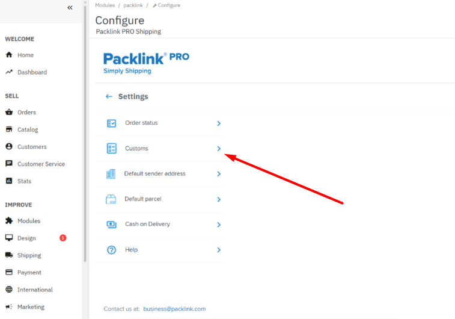
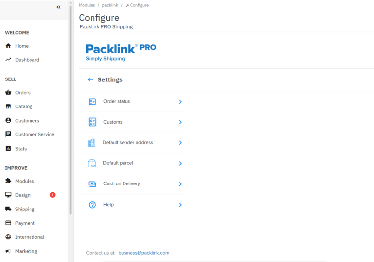
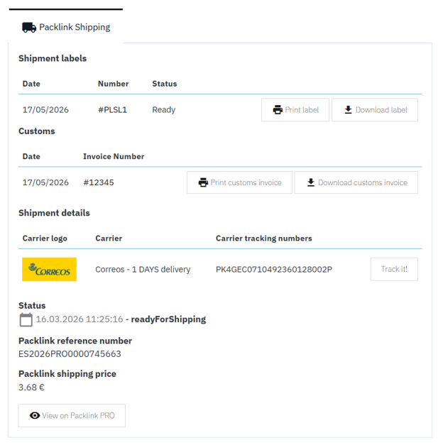
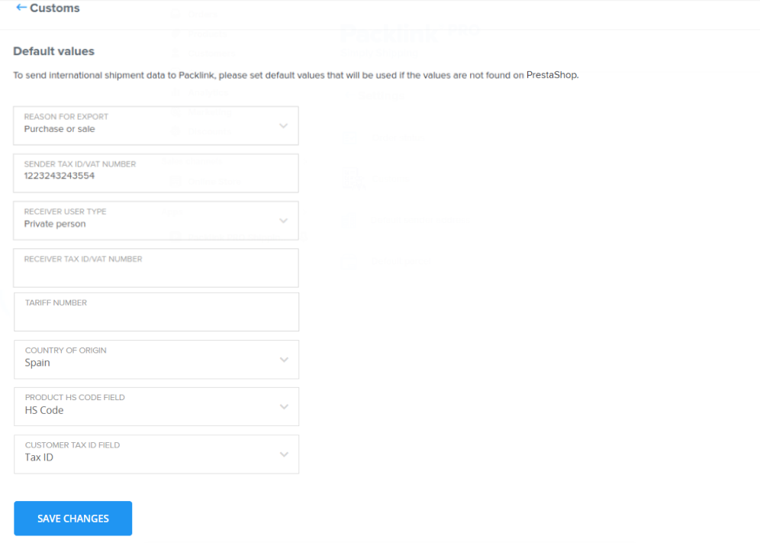
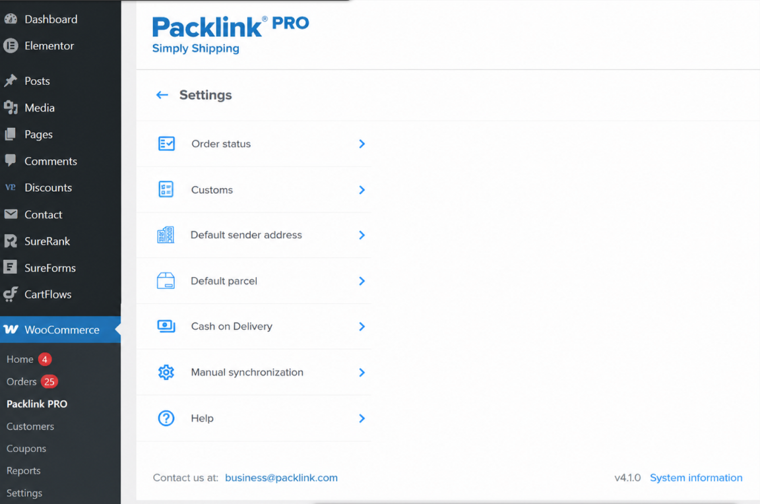
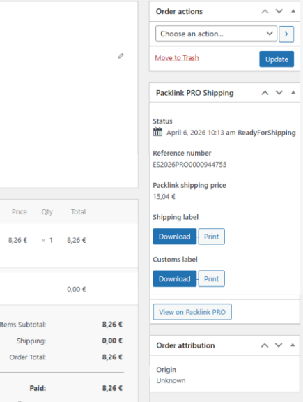
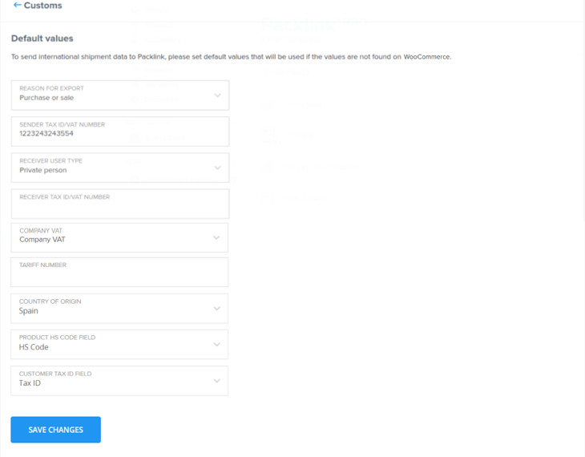

Packlink Integrations
Confidentiality: Confidential
## Packlink Integrations
## Packlink CR-SET-66 - Add customs support

CR-SET-66 - Add customs support in PrestaShop and WooCommerce
3
CR-SET-66 - PrestaShop
9
CR-SET-66 - WooCommerce
11

Packlink Integrations
Confidentiality: Confidential
## CR-SET-66 - Add customs support in PrestaShop and
## WooCommerce
## Document control
Field
Value
Document Owner
@Risto Keković
Approval Authority
@Predrag Krstojević
Document Code
PL-CR-SET-66
Version
1.0
Document Date
Jun 4, 2026
Approval Date
## Document history
Version
Description
Author
Date
v1.0
Initial analysis
@Risto Keković
Jun 4, 2026
## Introduction
This requirement has previously been specified and implemented in Shopify as part of CR
SET 42 - Adding customs support for international shipment. This change request set
specifies necessary changes for adding customs support in PrestaShop and
WooCommerce.
## Requirements
## Type of change
The next requirements need to be updated/added:
UI requirements: adding a new settings section for mapping customs attributes.
Functional requirements: add customs invoice synchronization.
Functional requirements: Update the shipment synchronization.
2

Packlink Integrations
Confidentiality: Confidential
UI requirements: extending the order details page with customs information.
## UI
Extend setting menu
Add new settings menu: Customs.
Mapping of data
All integrations should offer a setting of default values for required customs fields.
Depending on the integration, since some of the fields are customs-specific, the next
required fields should be checked if they exist in the integrated system:
Product → HS code
Product → country of origin
Customer → tax ID/VAT number
Customer → phone number
Other required fields from customs data are standard fields which all systems should
support already.
If the system doesn’t support some of the mentioned fields, then it should be checked if the
system offers custom attributes on these entities (product and customer).
If custom attributes exist, then integration should offer mapping of missing fields to system
custom attributes.
3

Packlink Integrations
Confidentiality: Confidential
## Functional requirements
Customs synchronization
The customs data schema can be found below:
Packlink Attribute
Packlink
Packlink
Packlink Attribute description
Attribute
Attribute
name
required
type
invoice_number
string
Yes (if
Identifier for a commercial invoice. If
reason_for_ex
the reason_for_export is
port=PURCHA
PURCHASE_OR_SALE, then the invoice
SE_OR_SALE)
number is requested.
sender
object
Yes
See
.
Sender data
receiver
object
Yes
See
.
Receiver data
inventory_of_content
array of
Yes
See
.
Inventory of contents data
s
objects
reason_for_export
string
Yes
Motivation of shipment.
Enum: [PURCHASE_OR_SALE,
PERSONAL_BELONGINGS, SAMPLE,
DOCUMENTS, RETURN]
shipment_details
object
Yes
See
.
Shipment details data
signature
object
No
See
.
Signature data
Sender data
Packlink Attribute
Packlink
Packlink
Packlink Attribute description
Attribute
Attribute
name
required
type
sender.user_type
string
Yes
Type of sender.
Enum: [PRIVATE_PERSON, COMPANY]
sender.full_name
string
Yes
Full name including all names and
surnames.
sender.tax_id
string
Yes (if
Tax id of a user, required in case
user_type=PRI
user_type is PRIVATE_PERSON.
VATE_PERSON)
sender.company_nam
string
Yes (if
Name of the company, required in case
e
user_type=CO
user_type is COMPANY.
MPANY)
sender.vat_number
string
Yes (if
VAT number of the company, required in
user_type=CO
case user_type is COMPANY.
MPANY)
4

Packlink Integrations
Confidentiality: Confidential
sender.eori_number
string
No
Economic Operator Registration and
Identification number.
sender.address
string
Yes
Full address including street name,
number, apartment, etc.
sender.postal_code
string
Yes
Postal code.
sender.city
string
Yes
City.
sender.country
string
Yes
Country name.
sender.phone_numbe
string
Yes
Phone number including country and area
r
code.
Receiver data
Packlink Attribute
Packlink
Packlink
Packlink Attribute description
Attribute
Attribute
name
required
type
receiver.user_type
string
Yes
Type of receiver.
Enum: [PRIVATE_PERSON, COMPANY]
receiver.full_name
string
Yes
Full name including all names and
surnames.
receiver.tax_id
string
Yes (if
Tax id of a user, required in case
user_type=PRI
user_type is PRIVATE_PERSON.
VATE_PERSON)
receiver.company_na
string
Yes (if
Name of the company, required in case
me
user_type=CO
user_type is COMPANY.
MPANY)
receiver.vat_number
string
Yes (if
VAT number of the company, required in
user_type=CO
case user_type is COMPANY.
MPANY)
receiver.eori_number
string
No
Economic Operator Registration and
Identification number.
receiver.address
string
Yes
Full address including street name,
number, apartment, etc.
receiver.postal_code
string
Yes
Postal code.
receiver.city
string
Yes
City.
receiver.country
string
Yes
Country name.
receiver.phone_numb
string
Yes
Phone number including country and area
er
code.
Inventory of contents data
5

Packlink Integrations
Confidentiality: Confidential
Packlink Attribute
Packlink
Packlink
Packlink Attribute description
Attribute
Attribute
name
required
type
tariff_number
string
Yes
The tariff number of an item, also known
as the "harmonized code" or "HS code,"
is a standardized number given to a
particular product or type of product for
easier identification during customs
processing and better standardization of
international shipping.
description
string
Yes
Detailed description of the item in English
(incl material, brand, size, etc).
country_of_origin
string
Yes
Country of manufacture of the item. ISO-
3166-1 Alpha-2.
item_value.currency
string
Yes
Currency of the item's value. ISO-4217.
item_value.value
number
Yes
Value of the item.
item_weight
number
Yes
Weight of each item, in kilograms.
quantity
integer
Yes
Number of identical items included.
Shipment details data
Packlink Attribute
Packlink
Packlink
Packlink Attribute description
Attribute
Attribute
name
required
type
parcels_size
integer
Yes
Amount of parcels on the shipment.
parcels_weight
number
Yes
Total weight of all parcels combined.
cost.currency
string
Yes
Currency of the item's value. ISO-4217.
cost.value
number
Yes
Value of the item.
Signature data
Packlink Attribute
Packlink
Packlink
Packlink Attribute description
Attribute
Attribute
name
required
type
full_name
string
Yes
Full name including all names and
surnames..
city
string
Yes
City.
Shipment synchronization
The shipment data schema should be extended with the following fields:
6

Packlink Integrations
Confidentiality: Confidential
Packlink Attribute
Packlink
Packlink Attribute
Packlink Attribute description
Attribute
required
name
type
This is always set to true if customs
has_customs
boolean
Yes (if
international
are created.
shipment)
customs.customs_inv
string
Yes (if
The customs id from the creation
oice_id
international
response.
shipment)
7

Packlink Integrations
Confidentiality: Confidential
## CR-SET-66 - PrestaShop
Product HS code and country of origin
Products in Prestashop don’t have the HS code field or the origin country.
Customer phone number and tax ID/VAT number
Customers in Prestashop have the phone number and company VAT, but it doesn’t have the
customer tax ID.
Custom fields support
Since Prestashop is on-premise system, the integration can extend both product and
customer entities.
Conclusion
The missing fields need to be mapped inside the Packlink plugin settings. The plugin will
add them upon installation/migration from previous versions and prepopulate it in the plugin
configuration.
8

Packlink Integrations
Confidentiality: Confidential
After the customs invoice becomes available and the integration receives the webhook, the
order details page should be extended with buttons for printing and downloading the
customs invoice.
9

Packlink Integrations
Confidentiality: Confidential
## CR-SET-66 - WooCommerce
Product HS code and country of origin
Products in WooCommerce don’t have the HS code field or the origin country.
Customer phone number and tax ID/VAT number
Customers in WooCommerce have the phone number, but it doesn’t have the company VAT
and the customer tax ID.
Custom fields support
Since WooCommerce is an on-premise system, the integration can extend both product
and customer entities. Also, WooCommerce supports custom attributes.
Conclusion
The missing fields need to be mapped inside the Packlink plugin settings. The plugin will
add them upon installation/migration from previous versions and prepopulate it in the plugin
configuration.
10

Packlink Integrations
Confidentiality: Confidential
After the customs invoice becomes available and the integration receives the webhook, the
order details page should be extended with buttons for printing and downloading the
customs invoice.
11

