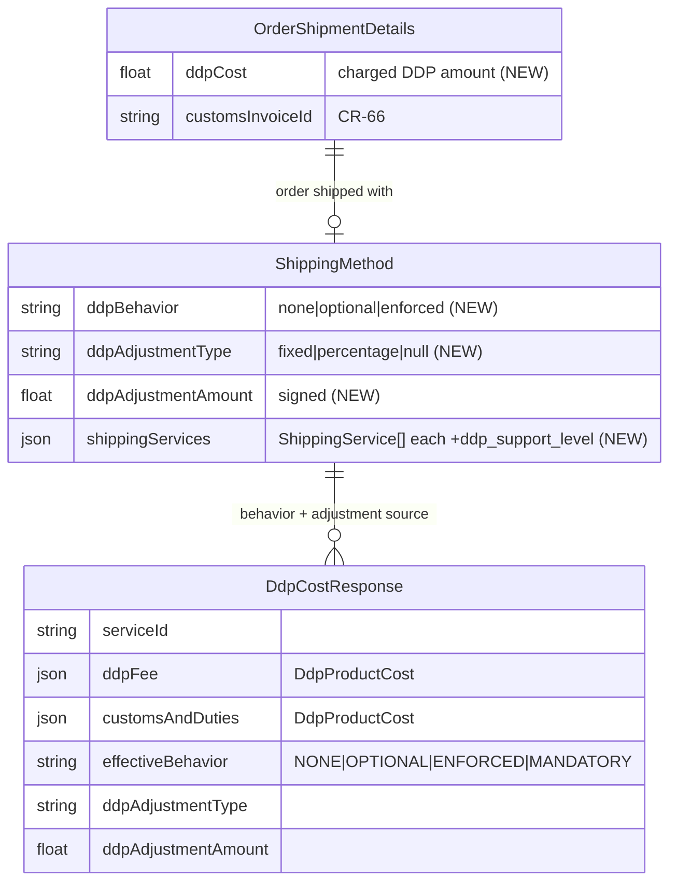
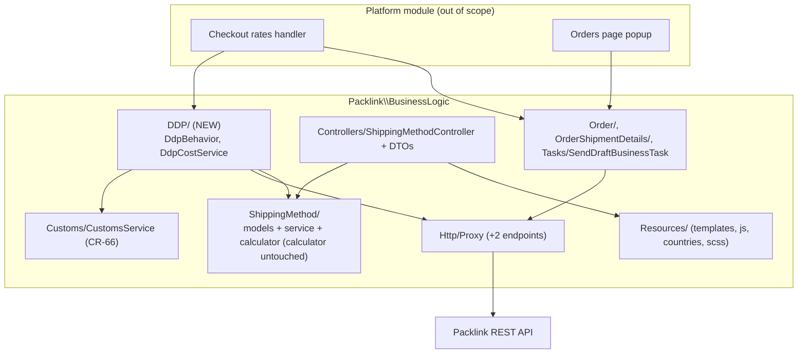
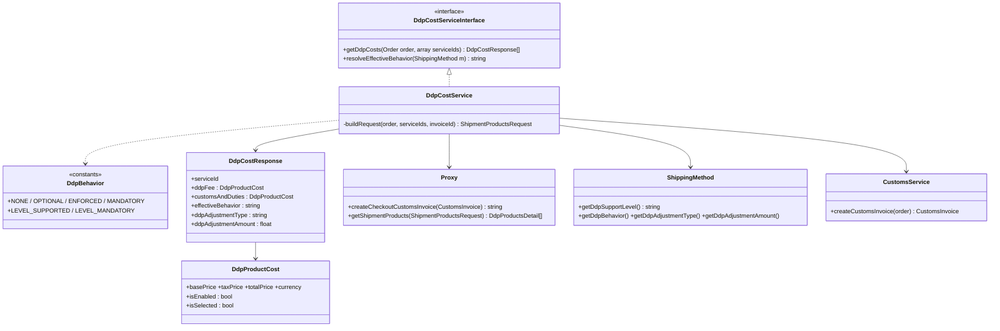
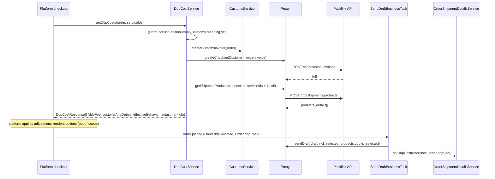

# Plan: CR-SET-68 — DDP Support (integration-core)

> **Tier:** Full (architectural) · **Status:** Implemented · **Date:** 2026-07-29 · **Spec:** [spec.md](spec.md) · **Research:** [research.md](research.md)
> **Branch:** `feature/cr-set-68-ddp-support` · **Delegation:** subagent-per-task (spec D13)

## 1. Goal

Add the platform-agnostic DDP building blocks to the core: sync the `ddp_support_level`
service flag, per-method merchant DDP configuration (behavior + adjustment), a `DdpCostService`
that retrieves DDP costs at checkout via `POST /v2/customs-invoices` + `POST /pro/shipments/products`,
the draft `selected_products.ddp.is_selected` flag, persisted `ddpCost` on `OrderShipmentDetails`,
and the shared UI (badge, behavior select, banners, adjust section) — all additive, no platform
contract breaks.

## 2. Current-state findings

Inspected (exact symbols):

- `src/BusinessLogic/Http/DTO/ShippingServiceDetails.php::fromArray` (L188-224) — parses `price`,
  `cash_on_delivery`, `tags`; no DDP field.
- `src/BusinessLogic/ShippingMethod/Models/ShippingService.php::fromServiceDetails/fromArray/toArray`
  (L100-171) — positional constructor; `CashOnDeliveryConfig` optional-nested precedent
  (array key `cash_on_delivery`).
- `src/BusinessLogic/ShippingMethod/Models/ShippingMethod.php::$fields` (L26-47),
  `inflate`/`toArray` (L184-249) — defaulting pattern in `inflate()` for new fields.
- `src/BusinessLogic/ShippingMethod/ShippingMethodService.php::setShippingService` (L600-622) —
  refresh path updates `serviceName/basePrice/totalPrice/taxPrice` on matched services.
- `src/BusinessLogic/Controllers/ShippingMethodController.php::save` (L162-197) — **returns `null`
  on any validation/save failure** (existing error contract); `updateModelData` (L288-300);
  `transformShippingMethodModelToDto` (L253-280).
- `src/BusinessLogic/Controllers/DTO/ShippingMethodConfiguration.php::toArray/fromArray` (L89-156);
  `DTO/ShippingMethodResponse.php::toArray` (L67-83).
- `src/BusinessLogic/Http/Proxy.php::call` (L709) prepends `BASE_URL . API_VERSION`;
  **`callBase()` (L734+) already exists for non-`v1/` endpoints** (used by `/pro/subscriptions/`);
  customs endpoints (L569-614) as pattern. Interface `Http/Interfaces/Proxy.php` mirrors public methods.
- `src/BusinessLogic/Customs/CustomsService.php::sendCustomsInvoice` (L114) and **`protected
  createCustomsInvoice($order)`** (L134-156) — full invoice assembly reusable for the checkout
  invoice; `CustomsService` is registered under the **concrete** class's `CLASS_NAME`
  (`BootstrapComponent.php:303`, imported concrete at L24).
- `src/BusinessLogic/Http/DTO/Draft.php::toArray` (L184-236) — optional nested blocks appended
  conditionally (`customs`, `cash_on_delivery` precedents).
- `src/BusinessLogic/Order/OrderService.php::updateShipmentData` (L132-149) — persists price/status/
  tracking/customs from `Shipment` + `$customsId` arg; `convertOrderToDraftDto` (L331).
- `src/BusinessLogic/Tasks/BusinessTasks/SendDraftBusinessTask.php` — L128 `prepareDraft`, L132
  `tryCreateCustomsInvoice`, L136 `sendDraft`, L144-149 `getShipment` + `updateShipmentData`.
- `src/BusinessLogic/OrderShipmentDetails/Models/OrderShipmentDetails.php::$fields` (L28-46,
  `customsInvoiceId` precedent), `toArray` (L186-205);
  `OrderShipmentDetailsService.php::updateShipmentCustomsData` (L151-159) as setter precedent.
- `src/BusinessLogic/Resources/js/EditServiceController.js::bindService` (L234-270), `save` (L322+,
  posts the whole `serviceModel`); `js/ShippingServicesRenderer.js::render` (L60+);
  templates `edit-shipping-service.html`, `shipping-services-list.html`, `shipping-services-table.html`.
- Translations: `src/BusinessLogic/Resources/countries/{en,de,es,fr}.json` (`shippingServices` group,
  en.json:437). SCSS: `Resources/scss/` (`.pl-info-box` in `subscription.scss` L58-86; no badge style).
- Real API sample (interview): services items carry `"ddp_support_level": null|"supported"|"mandatory"`.
- Checkout-flow PDF: request/response shapes for `/v2/customs-invoices` + `/pro/shipments/products`,
  draft `selected_products.ddp.is_selected`.

## 3. Scope & architecture-impact classification

**In scope:** everything in spec §2 "In scope (core)". **Out of scope:** spec §2 platform items.

**Classification: Full (architectural).** The change adds a new module (`BusinessLogic/DDP/`),
two new external endpoints on the Packlink boundary (one outside the `v1/` prefix), and extends
two persistence models (`ShippingMethod`, `OrderShipmentDetails`). Per `DESIGN.md` criteria that
is architectural. `DESIGN.md` sections updated in the same pass (task T8): §3 key components
(DdpCostService row), §4 domain model (ShippingMethod + OrderShipmentDetails field lists),
§6 module map (`BusinessLogic/DDP/` row), §8 external boundaries (two new outbound endpoints).
No ADR: the real alternatives were decided in the spec interview (D1–D13) and are recorded in
spec.md §3. Architecture-review runs in the review phase.

## 4. Changes

### Change A — `ddp_support_level` through the DTO/model/sync chain

- **Ref:** `src/BusinessLogic/Http/DTO/ShippingServiceDetails.php::fromArray`;
  `src/BusinessLogic/ShippingMethod/Models/ShippingService.php::fromServiceDetails/fromArray/toArray`;
  `src/BusinessLogic/ShippingMethod/ShippingMethodService.php::setShippingService`;
  *new file* `src/BusinessLogic/DDP/DdpBehavior.php`.
- **Before → after:**

  ```text
  // ShippingServiceDetails::fromArray — before: no ddp parsing
  $instance->cashOnDelivery = self::getDataValue($raw, 'cash_on_delivery', array());
  // after (+ public $ddpSupportLevel; + 'ddp_support_level' in toArray()):
  $instance->cashOnDelivery = self::getDataValue($raw, 'cash_on_delivery', array());
  $instance->ddpSupportLevel = self::getDataValue($raw, 'ddp_support_level', null);

  // ShippingService (model) — constructor gains optional 10th arg $ddpSupportLevel = null,
  // getter getDdpSupportLevel(), setter setDdpSupportLevel($level);
  // fromArray: isset($data['ddp_support_level']) ? $data['ddp_support_level'] : null
  // toArray:   'ddp_support_level' => $this->ddpSupportLevel
  // fromServiceDetails: passes $shippingServiceDetails->ddpSupportLevel

  // ShippingMethodService::setShippingService — refresh branch, before:
  $shippingService->basePrice = $newService->basePrice; ...
  // after: also
  $shippingService->setDdpSupportLevel($newService->getDdpSupportLevel());

  // new DdpBehavior (constants only, no deps):
  class DdpBehavior {
      const NONE = 'none'; const OPTIONAL = 'optional'; const ENFORCED = 'enforced';
      const MANDATORY = 'mandatory';
      const LEVEL_SUPPORTED = 'supported'; const LEVEL_MANDATORY = 'mandatory';
  }
  ```

- **Why:** the API flag must survive sync + persistence to drive badge/select/banners (spec §4.1).
- **Call cost:** none — rides the existing `GET v1/services` responses.

### Change B — merchant DDP config on `ShippingMethod`

- **Ref:** `src/BusinessLogic/ShippingMethod/Models/ShippingMethod.php::$fields/inflate/toArray`.
- **Before → after:**

  ```text
  // $fields — before ends with 'tags'; after adds:
  'ddpBehavior', 'ddpAdjustmentType', 'ddpAdjustmentAmount',

  // properties + accessors:
  protected $ddpBehavior = DdpBehavior::NONE;      // 'none'|'optional'|'enforced'
  protected $ddpAdjustmentType;                    // 'fixed'|'percentage'|null
  protected $ddpAdjustmentAmount = 0.0;            // signed float
  getDdpBehavior()/setDdpBehavior($b), getDdpAdjustmentType()/setDdpAdjustmentType($t),
  getDdpAdjustmentAmount()/setDdpAdjustmentAmount($a)

  // inflate() — defaulting like usePacklinkPriceIfNotInRange:
  $this->ddpBehavior = isset($data['ddpBehavior']) ? $data['ddpBehavior'] : DdpBehavior::NONE;
  $this->ddpAdjustmentType = isset($data['ddpAdjustmentType']) ? $data['ddpAdjustmentType'] : null;
  $this->ddpAdjustmentAmount = isset($data['ddpAdjustmentAmount']) ? (float)$data['ddpAdjustmentAmount'] : 0.0;

  // derived support level (used by controller + DdpCostService):
  public function getDdpSupportLevel() {
      // any service LEVEL_MANDATORY → 'mandatory'; else any LEVEL_SUPPORTED → 'supported'; else null
  }
  ```

- **Why:** spec §4.2 — single-scope merchant config persisted with the method (D9).
- **Call cost:** none (parent `toArray()` serializes scalar `$fields` automatically; no schema
  migration — ORM entities serialize by field list, absent keys default on `inflate`).

### Change C — config/response DTO round trip + validation + `customsConfigured`

- **Ref:** `src/BusinessLogic/Controllers/DTO/ShippingMethodConfiguration.php::toArray/fromArray`;
  `DTO/ShippingMethodResponse.php::toArray`;
  `src/BusinessLogic/Controllers/ShippingMethodController.php::save/updateModelData/transformShippingMethodModelToDto`.
- **Before → after:**

  ```text
  // ShippingMethodConfiguration: + public $ddpBehavior; + public $ddpAdjustmentType;
  // + public $ddpAdjustmentAmount; keys 'ddpBehavior','ddpAdjustmentType','ddpAdjustmentAmount'
  // in toArray()/fromArray() (fromArray defaults: 'none', null, 0.0)

  // ShippingMethodResponse: + public $ddpSupportLevel; + public $customsConfigured;
  // both appended in toArray()

  // ShippingMethodController::save — after currency validation, before updateModelData:
  if (!$this->isDdpConfigurationValid($shippingMethod, $model)) {
      return null;                        // existing error contract (returns null, logs)
  }
  // isDdpConfigurationValid(config, model): behavior in {none,optional,enforced};
  //   behavior !== 'none' only allowed when $model->getDdpSupportLevel() === 'supported';
  //   adjustmentType in {fixed, percentage, null}; amount numeric;
  //   percentage amount > -100; amount rounded to 2 decimals on assignment.

  // updateModelData — after fixedPrices/systemDefaults mapping:
  $model->setDdpBehavior($configuration->ddpBehavior);
  $model->setDdpAdjustmentType($configuration->ddpAdjustmentType);
  $model->setDdpAdjustmentAmount(round((float)$configuration->ddpAdjustmentAmount, 2));

  // transformShippingMethodModelToDto:
  $shippingMethod->ddpSupportLevel = $item->getDdpSupportLevel();
  $shippingMethod->customsConfigured = $this->getConfigService()->getCustomsMappings() !== null;
  // (+ existing ddp config fields via the parent Configuration DTO fields)
  ```

- **Why:** spec §4.2 — merchant edits ride the existing save path; UI needs
  `ddpSupportLevel`/`customsConfigured` read-only signals (spec §5 AC-2/AC-7).
- **Call cost:** none — `getCustomsMappings()` is a config-store read, no external call.

### Change D — DDP checkout DTOs + Proxy endpoints

- **Ref:** *new files* `src/BusinessLogic/Http/DTO/DDP/ShipmentProductsRequest.php`,
  `DDP/ShipmentProductsRequestItem.php`, `DDP/DdpProductsDetail.php`, `DDP/DdpProductCost.php`;
  `src/BusinessLogic/Http/Proxy.php` + `Http/Interfaces/Proxy.php`;
  `src/BusinessLogic/Customs/CustomsService.php::createCustomsInvoice`.
- **Before → after:**

  ```text
  // DTOs (all extend Data\DataTransferObject style used by Http/DTO):
  ShipmentProductsRequestItem { serviceId, contentValue, contentValueCurrency, customsInvoiceId }
    ->toArray(): {'service_id','contentvalue','contentValue_currency','customs':{'customs_invoice_id'}}
    // additional shipment fields elided in the requirement PDF — to confirm; isolated here.
  ShipmentProductsRequest { items: ShipmentProductsRequestItem[] } ->toArray(): {'shipments': [...]}
  DdpProductCost { basePrice, taxPrice, totalPrice, currency, isEnabled, isSelected }
    ::fromArray keys: base_price, tax_price, total_price, currency, is_enabled, is_selected
  DdpProductsDetail { serviceId|null, ddpFee: DdpProductCost|null, customsAndDuties: DdpProductCost|null }
    ::fromArray parses products_details[i].products.{ddp_fee, customs_and_duties} (+ service_id when present)
    ::fromBatch(array): DdpProductsDetail[]

  // Proxy (+ mirror signatures on Http/Interfaces/Proxy):
  public function createCheckoutCustomsInvoice(CustomsInvoice $customsInvoice) {
      $result = $this->callBase(HttpClient::HTTP_METHOD_POST, '/v2/customs-invoices',
          $customsInvoice->toArray())->decodeBodyToArray();
      return isset($result['id']) ? $result['id'] : null;
  }
  public function getShipmentProducts(ShipmentProductsRequest $request) {
      $result = $this->callBase(HttpClient::HTTP_METHOD_POST, '/pro/shipments/products',
          $request->toArray())->decodeBodyToArray();
      return DdpProductsDetail::fromBatch(isset($result['products_details']) ? $result['products_details'] : array());
  }

  // CustomsService::createCustomsInvoice — before: protected function createCustomsInvoice($shopOrder)
  // after:  public function createCustomsInvoice($shopOrder)   // visibility widened; NOT added to
  //         Customs\Interfaces\CustomsService (avoids touching an implementable contract)
  ```

- **Why:** spec §4.4 steps 1–2; `callBase()` already handles non-`v1/` endpoints.
- **Call cost:** +2 external calls per checkout DDP lookup, both **batched** — one invoice
  creation, one products call carrying *all* eligible services (no per-service N+1).

### Change E — `DdpCostService` + bootstrap registration

- **Ref:** *new files* `src/BusinessLogic/DDP/DdpCostService.php`,
  `src/BusinessLogic/DDP/Interfaces/DdpCostServiceInterface.php`,
  `src/BusinessLogic/DDP/Models/DdpCostResponse.php`;
  `src/BusinessLogic/BootstrapComponent.php::initServices`.
- **Before → after:**

  ```text
  interface DdpCostServiceInterface {
      const CLASS_NAME = __CLASS__;
      /** @return DdpCostResponse[] keyed by service id */
      public function getDdpCosts(Order $order, array $serviceIds);
      /** @return string one of DdpBehavior::NONE|OPTIONAL|ENFORCED|MANDATORY */
      public function resolveEffectiveBehavior(ShippingMethod $method);
  }

  DdpCostResponse { serviceId, ddpFee: DdpProductCost|null, customsAndDuties: DdpProductCost|null,
                    effectiveBehavior, ddpAdjustmentType, ddpAdjustmentAmount } + toArray()

  DdpCostService::getDdpCosts(Order $order, array $serviceIds):
      if (empty($serviceIds) || $this->getConfigService()->getCustomsMappings() === null) return array();
      try {
          $invoice = $this->getCustomsService()->createCustomsInvoice($order);
          if (!$invoice) return array();
          $invoiceId = $this->getProxy()->createCheckoutCustomsInvoice($invoice);
          if (!$invoiceId) return array();
          $details = $this->getProxy()->getShipmentProducts($this->buildRequest($order, $serviceIds, $invoiceId));
      } catch (HttpBaseException $e) { Logger::logWarning(...); return array(); }
      // match response to request: by service_id when present, else by index (to confirm)
      // attach owning method's effective behavior + adjustment config per service id
      return $responses;

  DdpCostService::resolveEffectiveBehavior(ShippingMethod $method):   // spec §4.3 table
      level mandatory → MANDATORY; level supported → map ddpBehavior
      (enforced→ENFORCED, optional→OPTIONAL, none→NONE); level null → NONE

  // BootstrapComponent::initServices — new registration next to CustomsService (L303):
  ServiceRegister::registerService(DdpCostServiceInterface::CLASS_NAME, function () {
      return new DdpCostService();   // resolves Proxy/CustomsService/Configuration lazily like peers
  });
  ```

- **Why:** spec §4.4/§4.3 — the single new checkout entry point (D2), error-safe (checkout never
  breaks on DDP failure), no caching (D7).
- **Call cost:** delegates to Change D's 2 batched calls; zero calls on the guard paths
  (no service ids / customs unconfigured / invoice assembly fails).

### Change F — Order + Draft + draft-task wiring

- **Ref:** `src/BusinessLogic/Order/Objects/Order.php` (private props + accessors);
  `src/BusinessLogic/Http/DTO/Draft.php::toArray`;
  `src/BusinessLogic/Order/OrderService.php::convertOrderToDraftDto`;
  `src/BusinessLogic/Tasks/BusinessTasks/SendDraftBusinessTask.php::execute`.
- **Before → after:**

  ```text
  // Order: + private $ddpSelected = false; + private $ddpCost;  (float|null)
  //        + isDdpSelected()/setDdpSelected($v), getDdpCost()/setDdpCost($v)

  // Draft: + public $ddpSelected = false;
  // toArray(), after the cash_on_delivery block:
  if ($this->ddpSelected) {
      $result['selected_products'] = array('ddp' => array('is_selected' => true));
  }

  // OrderService::convertOrderToDraftDto — after contentValue mapping:
  $draft->ddpSelected = $order->isDdpSelected();

  // SendDraftBusinessTask::execute — after updateShipmentData (L149):
  if ($order->isDdpSelected() && $order->getDdpCost() !== null) {
      $this->getOrderShipmentDetailsService()->setDdpCost($reference, $order->getDdpCost());
  }
  ```

- **Why:** spec §4.5 — Packlink learns the shipment is DDP (mandatory services block purchase
  without it); the charged cost is persisted for the orders page (D3). Persisting from the task
  (not `updateShipmentData`) keeps the webhook-shared `updateShipmentData(Shipment, $customsId)`
  signature untouched.
- **Call cost:** none added — the flag rides the existing `sendDraft` POST; `setDdpCost` is a
  repository write.

### Change G — `ddpCost` persistence on `OrderShipmentDetails`

- **Ref:** `src/BusinessLogic/OrderShipmentDetails/Models/OrderShipmentDetails.php::$fields/toArray`;
  `src/BusinessLogic/OrderShipmentDetails/OrderShipmentDetailsService.php`.
- **Before → after:**

  ```text
  // $fields: + 'ddpCost'  (after 'customsInvoiceId'); + protected $ddpCost; (float|null)
  // + getDdpCost()/setDdpCost($ddpCost); serialized by the generic $fields loop in toArray()

  // OrderShipmentDetailsService — mirror of updateShipmentCustomsData (L151):
  public function setDdpCost($shipmentReference, $ddpCost) {
      $orderDetails = $this->getDetailsByReferenceInternal($shipmentReference);
      $orderDetails->setDdpCost(round((float)$ddpCost, 2));
      $this->repository->update($orderDetails);
  }
  ```

- **Why:** spec §4.5 / AC-6 — orders-page popup reads the persisted value via existing exposure.
- **Call cost:** none external; one repository update per draft completion (same as customs).

### Change H — shared UI: badge + edit-service DDP section

- **Ref:** `src/BusinessLogic/Resources/templates/shipping-services-list.html` +
  `shipping-services-table.html`; `Resources/js/ShippingServicesRenderer.js::render`;
  `Resources/templates/edit-shipping-service.html`; `Resources/js/EditServiceController.js::bindService/save`.
- **Before → after:**

  ```text
  // list/table item templates — next to the service title element:
  <span class="pl-ddp-badge pl-hidden" data-pl-ddp-badge>{$shippingServices.ddpBadge}</span>

  // ShippingServicesRenderer.render — while populating each row:
  if (service.ddpSupportLevel) { row.querySelector('[data-pl-ddp-badge]').classList.remove('pl-hidden'); }

  // edit-shipping-service.html — after the service-title section, before price policy:
  <div id="pl-ddp-customs-banner" class="pl-info-box pl-hidden">…configure customs…</div>
  <div id="pl-ddp-mandatory-banner" class="pl-info-box pl-warning pl-hidden">…mandatory duties…</div>
  <section id="pl-ddp-section" class="pl-hidden">
    <select name="ddpBehavior" id="pl-ddp-behavior-select">   // 3 translated options
    <div id="pl-ddp-adjustment-group" class="pl-hidden">
      <select name="ddpAdjustmentType">fixed|percentage</select>
      <input name="ddpAdjustmentAmount" type="number" step="0.01">
    </div>
  </section>

  // EditServiceController.js::bindService — new bindDdpSection():
  //   level = serviceModel.ddpSupportLevel
  //   level truthy && !serviceModel.customsConfigured → show customs banner
  //   level === 'mandatory' → show mandatory banner (+ show adjustment group), hide behavior select
  //   level === 'supported' → show pl-ddp-section; select value = serviceModel.ddpBehavior || 'none';
  //     behavior change → serviceModel.ddpBehavior; toggle adjustment group (hidden iff 'none')
  //   bind ddpAdjustmentType/ddpAdjustmentAmount → serviceModel fields
  // save() posts serviceModel — new fields ride along (no change to the POST call)
  ```

- **Why:** spec §4.6 / mockups p7-p9; reuses `pl-hidden` show/hide and the whole-model POST.
- **Call cost:** none — data arrives on the existing getService/getServices responses.

### Change I — translations + SCSS

- **Ref:** `src/BusinessLogic/Resources/countries/{en,de,es,fr}.json` (`shippingServices` group);
  `src/BusinessLogic/Resources/scss/ui-controls.scss` (badge), `scss/subscription.scss`
  (`.pl-info-box` variant); compiled `Resources/css/app.css` via `cssCompile.php`.
- **Before → after:**

  ```text
  // en.json shippingServices group — new keys (de/es/fr get translated equivalents):
  "ddpBadge": "Customs and duties paid",
  "dutiesCostAtCheckout": "Duties cost at checkout",
  "ddpBehaviorLabel": "Behavior",
  "noDutiesCharged": "No duties charged on checkout",
  "offerDutiesOptionally": "Offer duties cost on checkout optionally",
  "enforceDutiesCost": "Enforce duties cost on checkout",
  "ddpMandatoryNotice": "This is a service that has mandatory duties cost included at checkout. Only activate this service if you consent with offering this service with duties cost included on the checkout.",
  "ddpConfigureCustomsNotice": "In order to offer this service to your customers, please configure customs information within this module.",
  "adjustDdpCost": "Adjust DDP cost",
  "ddpAdjustmentLabel": "Adjustment",
  "fixedAdjustment": "Fixed adjustment",
  "percentageAdjustment": "Percentage adjustment",
  "adjustmentAmount": "Adjustment amount"

  // SCSS: .pl-ddp-badge (dark pill, white text, small — per mockup p7);
  //        .pl-info-box.pl-warning (yellow bg #fff8e1, left border #f2c200 — per mockup p9)
  // php cssCompile.php; then: git diff on app.css MUST show only additions
  // (LEARNINGS.md 2026-07-17: hand-edited rules with no SCSS source get wiped — verify none lost)
  ```

- **Why:** spec §4.6 translations/SCSS; the app.css diff check guards the known trap.
- **Call cost:** none.

### Change J — DESIGN.md sync

- **Ref:** `DESIGN.md` §3 (key components), §4 (domain model), §6 (module map), §8 (external boundaries).
- **Before → after:**

  ```text
  §3 + row: DdpCostService | BusinessLogic/DDP/ | checkout DDP cost retrieval (2 batched calls) | Proxy, CustomsService, Configuration
  §4 ShippingMethod: + ddpBehavior, ddpAdjustmentType, ddpAdjustmentAmount; ShippingService json gains ddp_support_level
     OrderShipmentDetails: + float ddpCost
  §6 + row: BusinessLogic/DDP/ | DDP behavior resolution + checkout cost retrieval | DdpCostService, DdpBehavior
  §8 outbound: + createCheckoutCustomsInvoice (POST /v2/customs-invoices), getShipmentProducts (POST /pro/shipments/products) — non-v1 via callBase
  ```

- **Why:** Full-classification rule — DESIGN.md changes in the same pass.

## 5. External side-effects & call timing

| Trigger | What is checked | Reads (config / store) | External calls (system × count) |
|---|---|---|---|
| Platform checkout rate request → `DdpCostService::getDdpCosts()` | non-empty `$serviceIds`; customs mapping configured; invoice assembly succeeds | `Configuration::getCustomsMappings()`, warehouse config, `ShippingMethod` repo (behavior/adjustment per method) | Packlink × 2 batched: `POST /v2/customs-invoices` × 1, `POST /pro/shipments/products` × 1 (all services in one call). × 0 on any guard path |
| `SendDraftBusinessTask` (async queue) | `ddpSelected` && `ddpCost !== null` for the persist step | `Order` from `ShopOrderService`; `OrderShipmentDetails` repo | **none added** — existing `sendDraft`/`getShipment` calls only; `selected_products` rides the existing draft POST |
| `UpdateShippingServicesBusinessTask` (async queue) | unchanged | unchanged | **none added** — `ddp_support_level` parsed from existing `GET v1/services` responses |
| `ShippingMethodController::save` (platform HTTP endpoint) | DDP config validity (returns null on invalid) | `ShippingMethod` repo, `Configuration::getCustomsMappings()` | **none** |
| `ShippingMethodController::getAll/getActive/getShippingMethod` | — | `ShippingMethod` repo, config store (`customsConfigured`) | **none** |
| Webhook (`updateShipmentData`) | unchanged | unchanged | **none added** (signature untouched) |

Retry/recovery/idempotency: both DDP calls are read-side for checkout display — failure degrades to
"no DDP offered" (empty array, logged warning), never blocks rates; no retries in core (platform may
re-request rates). The checkout customs invoice is unattached to a shipment (per the flow PDF) —
re-creation on a later rate request is safe/expected. Draft flow idempotency unchanged
(task requeue re-runs `setDdpCost` with the same value — idempotent write).
State model: no new lifecycle states; draft status machine untouched.
Security: both new calls go through `Proxy` with the existing auth-token headers; no PII beyond what
the existing customs invoice already carries; no payloads logged (log only service ids/HTTP status).

## 6. Design decisions

| Decision | Options | Recommended | Trade-off |
|---|---|---|---|
| DDP config shape on `ShippingMethod` | (a) 3 flat fields; (b) nested `DdpConfig` object | **(a) flat** | Matches `taxClass`/scalar-field precedent, trivial `inflate`; nested object would mirror `pricingPolicies` but adds a serializer for 3 scalars |
| Draft DDP representation | (a) `bool $ddpSelected` emitting the nested block; (b) `SelectedProducts` DTO | **(a) bool** | The payload has exactly one boolean leaf today; a DTO earns its keep only if `selected_products` grows |
| Where `ddpCost` is persisted | (a) `SendDraftBusinessTask` after reference; (b) widen `OrderService::updateShipmentData()` signature | **(a) task** | (b) would touch the webhook call path for a value webhooks never carry |
| Products-response ↔ request matching | (a) `service_id` when present, index fallback; (b) index only | **(a)** | Response excerpt omits an explicit id; (a) survives both layouts — *to confirm against API reference* |
| Invalid DDP config on save | (a) return `null` (existing contract); (b) throw validation exception | **(a)** | Consistent with currency validation; (b) would change the save error contract for all platforms |
| Checkout invoice reuse | (a) widen `CustomsService::createCustomsInvoice` to public; (b) add to `Customs\Interfaces\CustomsService` | **(a)** | (b) changes an implementable interface (breaking for any platform-side implementation); (a) is registration-safe since the concrete class is the registered service |

### Invariants this change must preserve

| Invariant (rule) | Acceptance test |
|---|---|
| `ShippingCostCalculator` behavior is unchanged | Existing `tests/BusinessLogic/ShippingMethod/ShippingMethodServiceCostsTest.php` passes without modification |
| DDP failures never break checkout: `getDdpCosts()` never throws | `DdpCostServiceTest::testGetDdpCostsReturnsEmptyArrayOnHttpFailure` (TestHttpClient queued error) |
| Draft payload backward compatible: no `selected_products` key unless selected | `SendDraftTaskTest` asserts key absent for a non-DDP order, present+shaped for a DDP order |
| No platform-implementable contract changes (additive only) | Review check: diff touches no abstract class/interface under `Interfaces/` except `Http/Interfaces/Proxy` (core-implemented) + new `DDP/Interfaces/` |
| Core never references a platform | Existing suite + review grep (`PrestaShop\|WooCommerce\|Shopify\|Magento` in `src/BusinessLogic` yields nothing new) |
| Entities inflate legacy rows (pre-DDP data) with defaults | `ShippingMethodEntityTest`/`OrderShipmentDetailsEntityTest` inflate arrays without DDP keys → `none`/`null`/`0.0` |

## 7. Task breakdown & waves

| ID | Outcome (verifiable) | Implements | Files (`path::symbol`) | Interfaces (consumes → produces) | Verification | blockedBy | Wave |
|---|---|---|---|---|---|---|---|
| T1 | `ddp_support_level` parsed, synced, persisted; `ShippingMethod` carries DDP config fields + derived level; new `DdpBehavior` constants; tests green | A, B | `Http/DTO/ShippingServiceDetails.php::fromArray/toArray`, `ShippingMethod/Models/ShippingService.php`, `ShippingMethod/Models/ShippingMethod.php::$fields/inflate/toArray`, `ShippingMethod/ShippingMethodService.php::setShippingService`, new `DDP/DdpBehavior.php`, tests + `tests/.../ApiResponses/ShippingServices/*.json` fixture additions | — → `DdpBehavior::{NONE,OPTIONAL,ENFORCED,MANDATORY,LEVEL_SUPPORTED,LEVEL_MANDATORY}`; `ShippingService::getDdpSupportLevel()/setDdpSupportLevel($l)`; `ShippingMethod::getDdpSupportLevel()`, `getDdpBehavior()/setDdpBehavior($b)`, `getDdpAdjustmentType()/setDdpAdjustmentType($t)`, `getDdpAdjustmentAmount()/setDdpAdjustmentAmount($a)` | `php vendor/bin/phpunit -c phpunit.xml --filter "ShippingMethodEntityTest\|UpdateShippingServicesTaskTest\|ShippingMethodServiceTest"` | — | 1 |
| T2 | Proxy exposes both DDP endpoints returning parsed DTOs; `CustomsService::createCustomsInvoice` public; ProxyTest covers both with fixtures | D | new `Http/DTO/DDP/{ShipmentProductsRequest,ShipmentProductsRequestItem,DdpProductsDetail,DdpProductCost}.php`, `Http/Proxy.php`, `Http/Interfaces/Proxy.php`, `Customs/CustomsService.php::createCustomsInvoice`, new fixture `tests/BusinessLogic/Common/ApiResponses/DDP/productsResponse.json`, ProxyTest additions | — → `Proxy::createCheckoutCustomsInvoice(CustomsInvoice $i): string\|null`; `Proxy::getShipmentProducts(ShipmentProductsRequest $r): DdpProductsDetail[]`; `DdpProductsDetail{serviceId, ddpFee: DdpProductCost\|null, customsAndDuties: DdpProductCost\|null}`; `DdpProductCost{basePrice,taxPrice,totalPrice,currency,isEnabled,isSelected}`; `CustomsService::createCustomsInvoice($order): CustomsInvoice\|null` (public) | `php vendor/bin/phpunit -c phpunit.xml --filter "ProxyTest\|CustomsServiceTest"` | — | 1 |
| T3 | Order/Draft carry DDP selection; draft payload emits `selected_products.ddp.is_selected`; `ddpCost` persisted on `OrderShipmentDetails` after draft; tests green | F, G | `Order/Objects/Order.php`, `Http/DTO/Draft.php::toArray`, `Order/OrderService.php::convertOrderToDraftDto`, `Tasks/BusinessTasks/SendDraftBusinessTask.php::execute`, `OrderShipmentDetails/Models/OrderShipmentDetails.php::$fields`, `OrderShipmentDetails/OrderShipmentDetailsService.php`, tests | — → `Order::isDdpSelected()/setDdpSelected($v)`, `Order::getDdpCost()/setDdpCost($v)`; `Draft::$ddpSelected` (bool); `OrderShipmentDetails::getDdpCost()/setDdpCost($c)`; `OrderShipmentDetailsService::setDdpCost($shipmentReference, $ddpCost): void` | `php vendor/bin/phpunit -c phpunit.xml --filter "SendDraftTaskTest\|OrderShipmentDetailsServiceTest\|OrderShipmentDetailsEntityTest\|OrderServiceTest"` | — | 1 |
| T4 | Translation keys in all 4 country files; `.pl-ddp-badge` + `.pl-info-box.pl-warning` SCSS compiled; `app.css` diff shows additions only | I | `Resources/countries/{en,de,es,fr}.json`, `Resources/scss/ui-controls.scss`, `Resources/scss/subscription.scss`, `Resources/css/app.css` (recompiled) | — → translation keys `shippingServices.{ddpBadge,dutiesCostAtCheckout,ddpBehaviorLabel,noDutiesCharged,offerDutiesOptionally,enforceDutiesCost,ddpMandatoryNotice,ddpConfigureCustomsNotice,adjustDdpCost,ddpAdjustmentLabel,fixedAdjustment,percentageAdjustment,adjustmentAmount}`; CSS classes `.pl-ddp-badge`, `.pl-info-box.pl-warning` | `php cssCompile.php && git diff --stat src/BusinessLogic/Resources/css/app.css` (additions only; no deleted selectors) + `python3 -m json.tool` on each edited JSON | — | 1 |
| T5 | `DdpCostService` returns per-service `DdpCostResponse[]`, resolves effective behavior per spec §4.3 (5 rows unit-tested), empty array on every guard/error path; registered in bootstrap | E | new `DDP/DdpCostService.php`, `DDP/Interfaces/DdpCostServiceInterface.php`, `DDP/Models/DdpCostResponse.php`, `BusinessLogic/BootstrapComponent.php::initServices`, new `tests/BusinessLogic/DDP/DdpCostServiceTest.php` | `DdpBehavior` (T1), `ShippingMethod::getDdpSupportLevel/getDdpBehavior/getDdpAdjustment*` (T1), `Proxy::createCheckoutCustomsInvoice/getShipmentProducts` + DDP DTOs (T2), `CustomsService::createCustomsInvoice` public (T2) → `DdpCostServiceInterface::getDdpCosts(Order $order, array $serviceIds): DdpCostResponse[]`, `resolveEffectiveBehavior(ShippingMethod $m): string`; `DdpCostResponse{serviceId,ddpFee,customsAndDuties,effectiveBehavior,ddpAdjustmentType,ddpAdjustmentAmount}::toArray()` | `php vendor/bin/phpunit -c phpunit.xml --filter DdpCostServiceTest` | T1, T2 | 2 |
| T6 | Save round-trip persists valid DDP config and returns it on `ShippingMethodResponse` with `ddpSupportLevel` + `customsConfigured`; invalid configs make `save()` return null; controller tests green | C | `Controllers/DTO/ShippingMethodConfiguration.php::toArray/fromArray`, `Controllers/DTO/ShippingMethodResponse.php::toArray`, `Controllers/ShippingMethodController.php::save/updateModelData/transformShippingMethodModelToDto` (+ new `isDdpConfigurationValid`), ShippingMethodController tests | `ShippingMethod` DDP accessors + `getDdpSupportLevel()` (T1), `DdpBehavior` (T1) → `ShippingMethodConfiguration::$ddpBehavior/$ddpAdjustmentType/$ddpAdjustmentAmount` (array keys `ddpBehavior`,`ddpAdjustmentType`,`ddpAdjustmentAmount`); `ShippingMethodResponse::$ddpSupportLevel/$customsConfigured` | `php vendor/bin/phpunit -c phpunit.xml --filter ShippingMethodControllerTest` | T1 | 2 |
| T7 | Badge renders for DDP methods on overview; edit-service shows behavior select (supported), mandatory banner (mandatory), customs banner (unconfigured), adjust group toggling; fields post through save | H | `Resources/templates/shipping-services-list.html`, `shipping-services-table.html`, `edit-shipping-service.html`, `Resources/js/ShippingServicesRenderer.js::render`, `Resources/js/EditServiceController.js::bindService` (+ `bindDdpSection`) | response fields `ddpSupportLevel`,`customsConfigured`,`ddpBehavior`,`ddpAdjustmentType`,`ddpAdjustmentAmount` (T6, exact names); translation keys + CSS classes (T4) → DOM ids `pl-ddp-customs-banner`, `pl-ddp-mandatory-banner`, `pl-ddp-section`, `pl-ddp-behavior-select`, `pl-ddp-adjustment-group`; form names `ddpBehavior`,`ddpAdjustmentType`,`ddpAdjustmentAmount` | `node --check src/BusinessLogic/Resources/js/EditServiceController.js && node --check src/BusinessLogic/Resources/js/ShippingServicesRenderer.js` (no JS test harness exists — stated exception; behavior verified via DemoUI in the gate/review) | T4 | 2 |
| T8 | `DESIGN.md` §3/§4/§6/§8 reflect the shipped surface; spec/plan/tasks statuses updated | J | `DESIGN.md`, `docs/specs/cr-set-68-ddp-support/*` | final surface from T5/T6/T7 → updated docs | `grep -n "DdpCostService\|ddp_support_level\|ddpCost" DESIGN.md` (rows present) | T5, T6, T7 | 3 |

### Global constraints

- **PHP 7.0 floor** — `array()` syntax, no nullable/`void`/typed properties, PHPDoc types
  (`docs/coding-standard.md` is authoritative).
- **PHPUnit 4.8** — `@before`/`@after` annotations chaining `parent::before()`, no `void` on test
  methods, old assertion API; extend `BaseTestWithServices`; `TestHttpClient` + JSON fixtures under
  `tests/BusinessLogic/Common/ApiResponses/`; `MemoryRepository` via `TestRepositoryRegistry`.
- **Platform agnostic** — no platform names anywhere in `src/BusinessLogic`; UI strings only via
  translation keys; labels/options never hardcoded per platform.
- **Additive contracts only** — no signature changes to any abstract class or platform-implemented
  interface; `Http/Interfaces/Proxy` (core-implemented) is the only touched existing interface.
- **API field names are contract** — `ddp_support_level`, `selected_products.ddp.is_selected`,
  `products_details[].products.{ddp_fee,customs_and_duties}.{base_price,tax_price,total_price,currency,is_enabled,is_selected}`,
  request `shipments[].{service_id,contentvalue,customs.customs_invoice_id}`.
- **One task = one commit**, author name `Implementator`, message prefix `CR-SET-68:`.
- **Never edit `Resources/css/app.css` by hand**; only via `cssCompile.php`, then diff for lost selectors.

## 8. Testing strategy

- **Red test (TDD entry):** `DdpCostServiceTest::testGetDdpCostsSendsInvoiceThenProductsAndParsesComponents`
  — queue `createCustomsResult.json`-style + `productsResponse.json` on `TestHttpClient`, assert the
  two calls (order + URLs) and the parsed `DdpCostResponse` map. Written first in T5; each wave-1
  task likewise starts with its failing test (e.g. `fromArray` parsing `ddp_support_level`).
- **Unit:** DTO parsing (`ShippingServiceDetails`, `DdpProductCost/DdpProductsDetail`), entity
  inflate/toArray defaults (legacy rows), effective-behavior table (5 rows), validation matrix in
  `isDdpConfigurationValid`, adjustment rounding.
- **Integration/contract:** ProxyTest asserting exact URLs (`/v2/customs-invoices`,
  `/pro/shipments/products` — no `v1/` prefix) and payload shapes; `SendDraftTaskTest` end-to-end
  draft payload + `ddpCost` persistence; `UpdateShippingServicesTaskTest` sync with the real-sample
  fixture (UPS `supported`, others `null`).
- **Regression:** full existing suite, with `ShippingMethodServiceCostsTest` explicitly unmodified
  (invariant); entity tests inflating pre-DDP serialized rows.

## 9. Verification gates

Run from the repo root at the end of every wave and at closing:

```bash
php vendor/bin/phpunit --configuration phpunit.xml
php cssCompile.php && git diff --exit-code src/BusinessLogic/Resources/css/app.css || git diff src/BusinessLogic/Resources/css/app.css   # after T4: additions only, no removed selectors
git grep -n -iE "prestashop|woocommerce|shopify|magento" -- src/BusinessLogic ':!src/BusinessLogic/Resources' | grep -v "Binary" ; test $? -ne 0 || true   # platform-agnosticism spot check (expect no new hits)
```

(Per-task `Verification` columns are the orchestrator's narrower re-run keys, not the gate.)

## 10. Diagrams

### Model diagram (delta)



### Module-dependency diagram



### Class diagram (key new/changed classes)



### Sequence diagram — checkout DDP cost retrieval + draft



## 11. Risks & emphasis

| Area | Risk | Mitigation |
|---|---|---|
| External API access | `/pro/shipments/products` request item fields partially unspecified (elided in PDF) | Isolated in `ShipmentProductsRequestItem::toArray()`; marked to-confirm; contract test pins current shape so a change is a one-file fix |
| External API access | Response↔request matching rule unconfirmed (id vs index) | Parse `service_id` when present, index fallback; unit test covers both layouts |
| Integration reliability | DDP call failures during checkout | Guard paths + catch-all → empty array + warning log; invariant test |
| Domain-critical data | Money precision (DDP amounts, adjustment) | Floats rounded to 2 decimals at boundaries (existing convention); currency carried on every cost DTO |
| Serialization compat | New entity fields on in-flight data | `inflate()` defaults for absent keys; entity tests inflate legacy rows |
| Unit/service leanness | `DdpCostService` absorbing presentation logic | Scope pinned by spec D2/D8/D12: no totals, no adjustment application, no option-splitting in core |
| Design-doc alignment | DESIGN.md drift | T8 in the same feature branch, blocked on the code tasks |

## 12. Review sequence

1. Code review (`engineering-core:code-review`)
2. Simplification review (`engineering-core:simplify`)
3. Security review (`engineering-core:security-review`)
4. Architecture review (`engineering-core:architecture-review`, architect agent — Full change)
5. Docs sync (DESIGN.md T8, spec/tasks statuses)
6. Corrections/learnings sync (`LEARNINGS.md`)

## 13. Rollout / migration

No migration: entity fields are additive with `inflate()` defaults, so pre-DDP rows load cleanly;
no config keys change; no platform contract changes — platform modules adopt DDP by consuming the
new service/DTO fields at their own pace. Old call sites are unaffected (no renames). Delivery to
the client repo goes through `docs/tools/publish-to-origin.sh` as usual (internal docs stripped).
