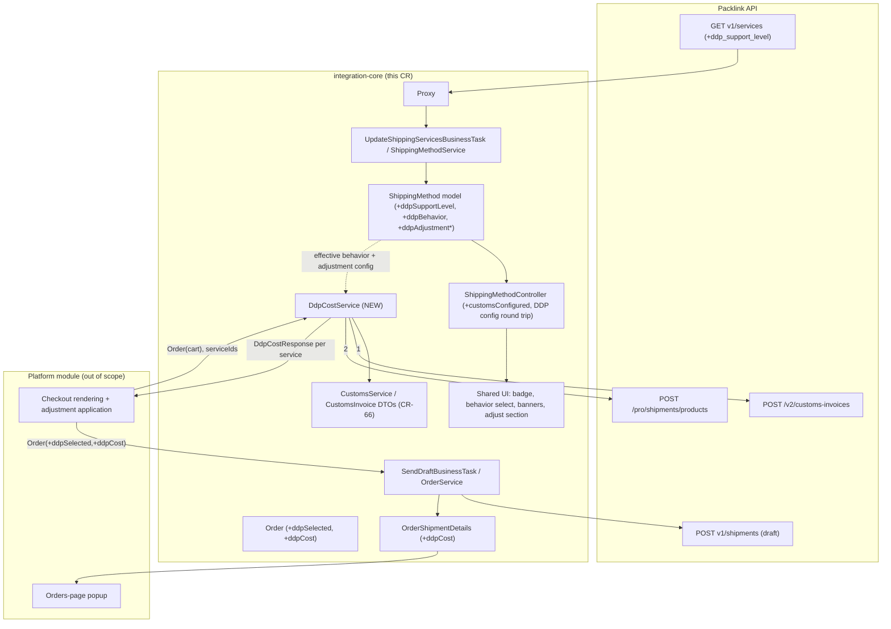

# Spec: CR-SET-68 — DDP Support (integration-core)

> **Version:** 1.0
> **Date:** 2026-07-29
> **Status:** Awaiting approval
> **Layer:** integration-core (shared across all Packlink modules)
> **Sources:** `CR-68-DDP-Support.pdf` (v1.2), `PACKLINK-CR-SET-68-01 - Checkout flow` PDF,
> real `GET /v1/services` response sample (provided during interview),
> `docs/specs/cr-set-68-ddp-support/research.md`

---

## 1. Goal

Add the platform-agnostic building blocks for Delivered Duty Paid (DDP) shipping to the
integration core, so that platform modules (Shopify first; WooCommerce/PrestaShop after) can:
mark DDP-capable services, let merchants configure duties-cost behavior and a DDP cost
adjustment per service, retrieve DDP costs at checkout, flag drafts as created-with-DDP, and
show the charged DDP cost on their orders page.

DDP is offered by Packlink for UPS only in v1, but core behavior is driven entirely by the
API's `ddp_support_level` field — no carrier names are hardcoded.

## 2. Scope

**In scope (core):**
- Parse and persist the new `ddp_support_level` service field through the services sync.
- Per-shipping-method merchant configuration: duties-cost behavior + DDP cost adjustment.
- A new DDP cost service wrapping the two-call checkout flow
  (`POST /v2/customs-invoices` → `POST /pro/shipments/products`).
- Draft DTO extension (`selected_products.ddp.is_selected`) and DDP-cost persistence on
  `OrderShipmentDetails` for the orders page.
- Shared UI: overview badge, edit-service behavior select, two banners, adjust-DDP section,
  translations, SCSS, DemoUI reference wiring.
- Automated tests for all of the above.

**Out of scope (platform modules):**
- Checkout rendering: duplicating the shipping option (with/without DDP), the "Delivery Duty
  Paid" line item, totals, and applying the merchant adjustment to the presented amount.
- Orders-page popup markup (core only persists/exposes the DDP cost).
- Mapping platform cart/customer data into the core `Order` object at checkout.
- The Shopify DDP companion app specifics (empty carrier response handling etc.).

## 3. Decisions (interview record)

| # | Decision | Chosen option |
|---|----------|---------------|
| D1 | Unknown API contracts | Real contracts used where provided: services `ddp_support_level` (`null`/`"supported"`/`"mandatory"`), checkout endpoints `POST /v2/customs-invoices` + `POST /pro/shipments/products`, draft field `selected_products.ddp.is_selected`. Request fields elided (`...`) in the checkout PDF are specced as placeholders **marked "to confirm against Packlink API reference"** and isolated in DTOs/Proxy methods. |
| D2 | Checkout core/platform boundary | **Separate DDP-cost service**; `ShippingCostCalculator::getShippingCosts()` untouched. Platforms compose regular costs + DDP costs themselves. |
| D3 | DDP selection & cost on the order | **Platform sets it on `Order`** (`ddpSelected`, charged `ddpCost`). Draft carries `selected_products.ddp.is_selected = true`; core persists the platform-supplied charged DDP cost on `OrderShipmentDetails` when shipment data is updated (mirrors `customsInvoiceId`). |
| D4 | Adjustment semantics | Fixed amount **or** percentage, **increase or decrease** (signed amount), floor at 0, 2-decimal rounding. |
| D5 | Behavior default & customs coupling | New services default to **"No duties charged on checkout"**; the customs-not-configured banner is **informational only** — no save validation coupling to customs state. |
| D6 | Overview badge rule | Badge shown iff the method's `ddp_support_level` is `supported` **or** `mandatory` (pure function of the synced API flag; national/international not consulted). |
| D7 | Caching | **No caching in v1**; one live products call per checkout rate request. The service interface leaves room to add caching later. |
| D8 | Mandatory/enforced output | Core always returns DDP cost data **separately** plus an **effective behavior flag** (`NONE`/`OPTIONAL`/`ENFORCED`/`MANDATORY`); folding into the displayed price is platform presentation. |
| D9 | Multistore | **Single DDP config per shipping method** (no per-system scoping). |
| D10 | CoD / insurance interplay | **Independent** — no interaction rules. |
| D11 | DDP cost composition | **Keep components separate**: core exposes `ddp_fee` and `customs_and_duties` as distinct figures; **no core-computed combined total**. |
| D12 | Adjustment application point | **Platform applies the adjustment** to whatever customer-facing amount it composes; core only stores and exposes the adjustment config (type + signed amount). |
| D13 | Delegation | **Yes** — implement via subagent-per-task delegation, parallel waves, one commit per task. |

## 4. Core behavior specification

### 4.1 Services API → model (sync)

`GET /v1/services` items now carry `"ddp_support_level": null | "supported" | "mandatory"`
(confirmed by the real response sample; DDP-capable services additionally carry a
`{"id": "DDP"}` tag, which core does **not** use — the level field is authoritative).

- `Http/DTO/ShippingServiceDetails` gains `$ddpSupportLevel` (string|null), parsed in
  `fromArray()` / serialized in `toArray()`.
- The `ShippingMethod/Models/ShippingService` business model gains `$ddpSupportLevel`,
  copied in `fromServiceDetails()`, round-tripped in `fromArray()`/`toArray()`, and
  **updated on existing services** during sync (`ShippingMethodService::setShippingService()`
  refresh path).
- `ShippingMethod` exposes a derived `getDdpSupportLevel()`: `"mandatory"` if any of its
  services is mandatory, else `"supported"` if any is supported, else `null`.
  *(Derivation rule to confirm in practice; v1 is UPS-only so mixed methods are unlikely.)*

### 4.2 Merchant configuration (per shipping method)

New `ShippingMethod` fields (single scope, D9):

| Field | Type | Values / default |
|---|---|---|
| `ddpBehavior` | string | `none` (default) \| `optional` \| `enforced` — meaningful only when the method's support level is `supported` |
| `ddpAdjustmentType` | string\|null | `fixed` \| `percentage` \| `null` (no adjustment) |
| `ddpAdjustmentAmount` | float | signed; default 0 |

Round trip: `ShippingMethodConfiguration` (fromArray/toArray) → `ShippingMethodController::
updateModelData()` → model → `transformShippingMethodModelToDto()` → `ShippingMethodResponse`
(which additionally exposes read-only `ddpSupportLevel` and `customsConfigured`).

Validation on save (`ShippingMethodController::save()` path):
- `ddpBehavior` ∈ {`none`, `optional`, `enforced`}; rejected for methods whose support level
  is `null` or `mandatory` unless it is `none` (mandatory services have no behavior select).
- `ddpAdjustmentType` ∈ {`fixed`, `percentage`, `null`}; `ddpAdjustmentAmount` numeric,
  rounded to 2 decimals; for `percentage`, amount > -100.
- No coupling to customs configuration state (D5).

`customsConfigured` (bool, read-only on `ShippingMethodResponse`) is computed as
`Configuration::getCustomsMappings() !== null` — the raw config value, **not**
`CustomsMappingService::getCustomsMappings()`, which masks null with an empty mapping.

### 4.3 Effective DDP behavior

A single resolution rule, implemented once in core and exposed to platforms:

| API `ddp_support_level` | Merchant `ddpBehavior` | Effective behavior |
|---|---|---|
| `mandatory` | (ignored) | `MANDATORY` |
| `supported` | `enforced` | `ENFORCED` |
| `supported` | `optional` | `OPTIONAL` |
| `supported` | `none` | `NONE` |
| `null` | (any) | `NONE` |

Platform semantics (informative): `MANDATORY`/`ENFORCED` → only the DDP option is offered;
`OPTIONAL` → two options; `NONE` → no DDP cost presented.

### 4.4 DDP cost retrieval (checkout)

New service `Packlink\BusinessLogic\DDP\DdpCostService` (registered in
`BusinessLogic\BootstrapComponent`, interface under `DDP\Interfaces\`), no caching (D7):

1. **Create a checkout customs invoice** — `Proxy::createCheckoutCustomsInvoice(CustomsInvoice)`
   → `POST /v2/customs-invoices`. Reuses the existing `CustomsInvoice` DTO tree; the invoice
   is built by the existing `CustomsService` assembly from the `Order`-shaped object the
   platform passes (platforms already build `Order` objects; at checkout they build one from
   the cart). Returns `customs_invoice_id`. *(v2 request shape assumed identical to the v1
   CustomsInvoice — to confirm against Packlink API reference.)*
2. **Fetch DDP costs** — `Proxy::getShipmentProducts(ShipmentProductsRequest)` →
   `POST /pro/shipments/products` with `shipments[]`, one entry per DDP-relevant service:
   `{service_id, contentvalue, ..., customs: {customs_invoice_id}}`. *(Fields elided in the
   requirement PDF — additional shipment fields, e.g. addresses/packages, to confirm; the
   request DTO isolates them.)*
3. **Parse the response** — `products_details[]` → per service a `DdpCost` DTO:
   - `ddpFee`: `{basePrice, taxPrice, totalPrice, currency, isEnabled, isSelected}`
   - `customsAndDuties`: same shape
   - Components stay separate (D11); **no combined total**.
   - Flag semantics (from the checkout PDF): `is_enabled` — the service/route supports DDP
     and the cost may be presented; `is_selected` — the summary `total_price` includes that
     fee. Core exposes both verbatim.

Public API (signature at spec altitude):

```php
// returns array<int|string serviceId, DdpCostResponse>
DdpCostService::getDdpCosts(Order $checkoutOrder, array $serviceIds);
```

`DdpCostResponse` carries: `serviceId`, `ddpFee`, `customsAndDuties`, and (for caller
convenience) the owning method's `effectiveBehavior`, `ddpAdjustmentType`,
`ddpAdjustmentAmount` — the platform applies the adjustment itself (D12) and composes the
presented amount. Errors from either call are logged and yield an empty result (checkout
must never break on DDP failures).

`ShippingCostCalculator` is not modified (D2).

**Proxy note:** both endpoints are outside the `v1/` prefix that `Proxy::call()` prepends
(`/v2/customs-invoices`, `/pro/shipments/products`) — the Proxy additions must bypass or
override the version segment.

### 4.5 Draft & persistence (orders page)

- `Order` (BusinessLogic/Order/Objects) gains `ddpSelected` (bool, default false) and
  `ddpCost` (float|null) — the **charged** (platform-adjusted) DDP amount in the order's
  currency, set by the platform at draft time.
- `Http/DTO/Draft` gains `selectedProducts`; when `Order::$ddpSelected` is true,
  `toArray()` emits `"selected_products": {"ddp": {"is_selected": true}}` (per the checkout
  PDF; required for mandatory services — skipping blocks the purchase).
  `OrderService::convertOrderToDraftDto()` maps it.
- `OrderShipmentDetails` gains persisted `ddpCost` (float|null);
  `OrderShipmentDetailsService::setDdpCost($reference, $ddpCost)` mirrors
  `updateShipmentCustomsData()`; `OrderService::updateShipmentData()` persists
  `Order::$ddpCost` alongside shipping price/customs id.
- The orders-page popup (platform scope) reads the persisted `ddpCost` from the existing
  shipment-details exposure (`OrderShipmentDetails::toArray()` includes it).

### 4.6 Shared UI

**Overview page** (`my-shipping-services` templates + `ShippingServicesRenderer.js`):
- A **"Customs and duties paid"** badge next to the service title in both list and table
  render targets when `ddpSupportLevel` ∈ {supported, mandatory} (D6). New badge SCSS
  (no badge style exists today) + translation key.

**Edit-service page** (`edit-shipping-service.html` + `EditServiceController.js`):
- **Customs-not-configured banner** (blue `.pl-info-box`, existing style): shown when the
  method is DDP-capable and `customsConfigured` is false. Text per mockup: "In order to
  offer this service to your customers, please configure customs information within this
  module." Informational only (D5).
- **`supported` methods** — new section **"Duties cost at checkout"**: a select with
  *No duties charged on checkout* (default) / *Offer duties cost on checkout optionally* /
  *Enforce duties cost on checkout*, bound to `ddpBehavior`.
- **`mandatory` methods** — the behavior select is not rendered; a **warning banner**
  (new yellow `.pl-info-box` variant, per mockup p9): "This is a service that has mandatory
  duties cost included at checkout. Only activate this service if you consent with offering
  this service with duties cost included on the checkout."
- **"Adjust DDP cost"** section: adjustment type select (*Fixed adjustment* / *Percentage
  adjustment*) + amount input, bound to `ddpAdjustmentType`/`ddpAdjustmentAmount`; visible
  when the effective behavior can charge duties (behavior `optional`/`enforced`, or level
  `mandatory`); hidden for `none`.
- All show/hide via the existing `pl-hidden` mechanism; form posts ride the existing
  `saveServiceUrl` round trip.

**Translations:** new keys in the `shippingServices` group of
`src/BusinessLogic/Resources/countries/{en,de,es,fr}.json` (badge label, section titles,
select options, both banner texts, adjustment labels). en authored from the mockups;
de/es/fr translated equivalents.

**SCSS:** badge style + warning info-box variant in `Resources/scss/`; recompile via
`cssCompile.php`; **diff `app.css` for deleted selectors before committing**
(LEARNINGS.md 2026-07-17 trap).

**DemoUI:** reference wiring for any new endpoint/config keys (e.g. exposing
`customsConfigured` through the existing getService response requires no new DemoUI route).

## 5. Acceptance criteria

1. **Sync:** after `UpdateShippingServicesBusinessTask` runs against a services response
   containing `ddp_support_level`, each stored `ShippingService`/`ShippingMethod` reflects
   the level; re-sync updates changed levels on existing methods.
2. **Config round trip:** saving a `ShippingMethodConfiguration` with
   `ddpBehavior=optional`, `ddpAdjustmentType=percentage`, `ddpAdjustmentAmount=-10` persists
   and returns the same values in `ShippingMethodResponse`; invalid values (unknown behavior,
   unknown adjustment type, non-numeric amount, percentage ≤ -100, behavior other than `none`
   on a non-`supported` method) are rejected with validation errors.
3. **Effective behavior:** the resolution table in §4.3 is implemented and unit-tested for
   all five rows.
4. **DDP costs:** `DdpCostService::getDdpCosts()` issues `POST /v2/customs-invoices` then
   `POST /pro/shipments/products` (asserted via `TestHttpClient`), returns per-service
   `DdpCostResponse` with separate `ddpFee`/`customsAndDuties` components and correct
   flag parsing; on HTTP failure of either call it logs and returns an empty array.
5. **Draft:** an `Order` with `ddpSelected=true` produces a draft payload containing
   `selected_products.ddp.is_selected = true`; with `ddpSelected=false` the key is absent.
6. **Persistence:** after `updateShipmentData()` for an order with `ddpCost=12.00`,
   `OrderShipmentDetails::getDdpCost()` returns 12.00 and survives entity
   serialize/inflate; `toArray()` exposes it.
7. **Response DTO:** `ShippingMethodResponse` carries `ddpSupportLevel` and
   `customsConfigured` (false when `Configuration::getCustomsMappings()` is null, true
   otherwise).
8. **UI:** badge markup renders for supported/mandatory methods only; behavior select
   renders only for `supported`; mandatory banner only for `mandatory`; customs banner only
   when `customsConfigured=false` and the method is DDP-capable; adjust section hidden for
   behavior `none`. (Asserted at the JS/template level per existing UI test practice, or via
   DemoUI reference wiring review if no JS harness exists.)
9. **Quality gate:** full PHPUnit suite green (`php vendor/bin/phpunit --configuration
   phpunit.xml`); no modification to `ShippingCostCalculator` behavior (existing cost tests
   unchanged and green).
10. **No breaking changes** to abstract platform contracts (all additions are additive).

## 6. Dependencies

Depends on CR-SET-66 customs support (customs configuration + `CustomsInvoice` DTO tree +
`CustomsService` assembly) — already in core. Platform delivery for PrestaShop/WooCommerce
additionally depends on their CR-SET-66 platform work (out of core scope).



## 7. Delegation decision

**Yes** — implementation via subagent-per-task delegation (parallel waves, one local commit
per task authored `Implementator`), per the Logeecom flow (D13).
