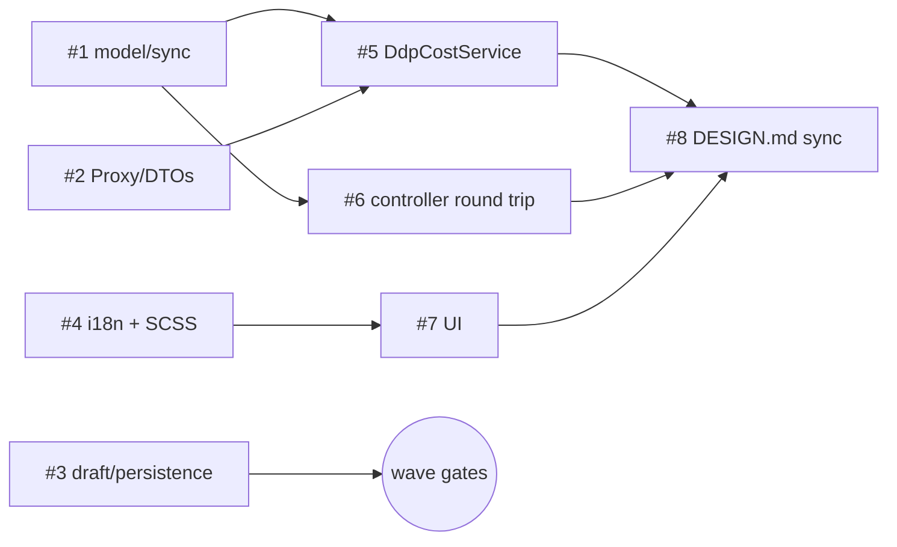

# Tasks: CR-SET-68 — DDP Support

> Snapshot of the registered task graph (task system IDs #1–#8). Full detail per task: [plan.md](plan.md) §7.
> One task = one commit, author `Implementator`, message prefix `CR-SET-68:`. Delegation: subagent-per-task (spec D13).

| # | Task | Implements (plan §4) | blockedBy | Wave | Status |
|---|------|----------------------|-----------|------|--------|
| 1 | T1: Sync `ddp_support_level` + `ShippingMethod` DDP config fields (+`DdpBehavior` constants) | A, B | — | 1 | pending |
| 2 | T2: DDP checkout DTOs + Proxy endpoints (`/v2/customs-invoices`, `/pro/shipments/products`) + public `createCustomsInvoice` | D | — | 1 | pending |
| 3 | T3: Order/Draft DDP selection (`selected_products.ddp.is_selected`) + `ddpCost` persistence | F, G | — | 1 | pending |
| 4 | T4: Translations (en/de/es/fr) + SCSS (badge, warning info-box) + `cssCompile.php` | I | — | 1 | pending |
| 5 | T5: `DdpCostService` + interface + bootstrap registration | E | 1, 2 | 2 | pending |
| 6 | T6: Controller/DTO round trip + validation + `customsConfigured` | C | 1 | 2 | pending |
| 7 | T7: Shared UI — overview badge + edit-service DDP section | H | 4 | 2 | pending |
| 8 | T8: DESIGN.md + docs sync | J | 5, 6, 7 | 3 | pending |

## Dependency graph

Waves: **1** = #1 #2 #3 #4 (parallel) · **2** = #5 #6 #7 (parallel) · **3** = #8.
Gate after every wave: `php vendor/bin/phpunit --configuration phpunit.xml` (plan §9).
